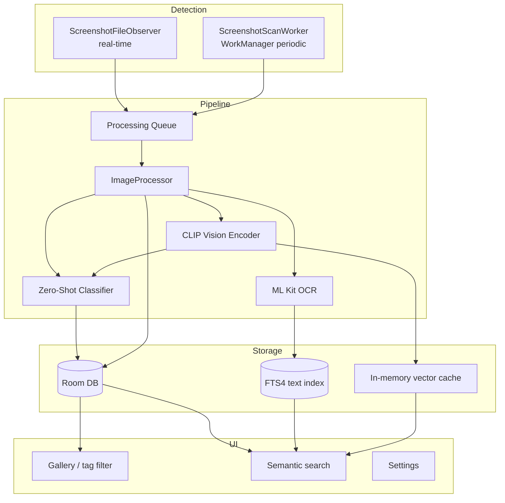
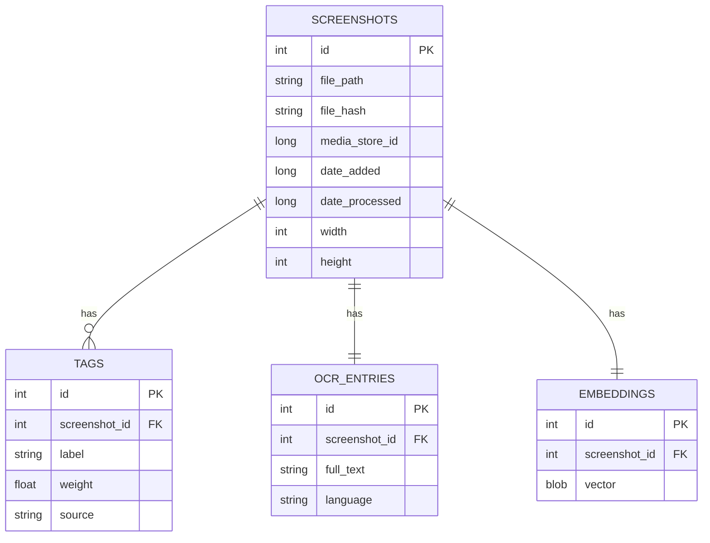
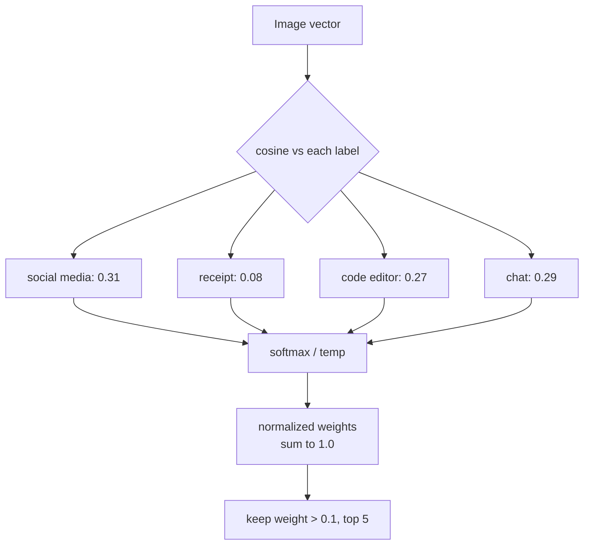
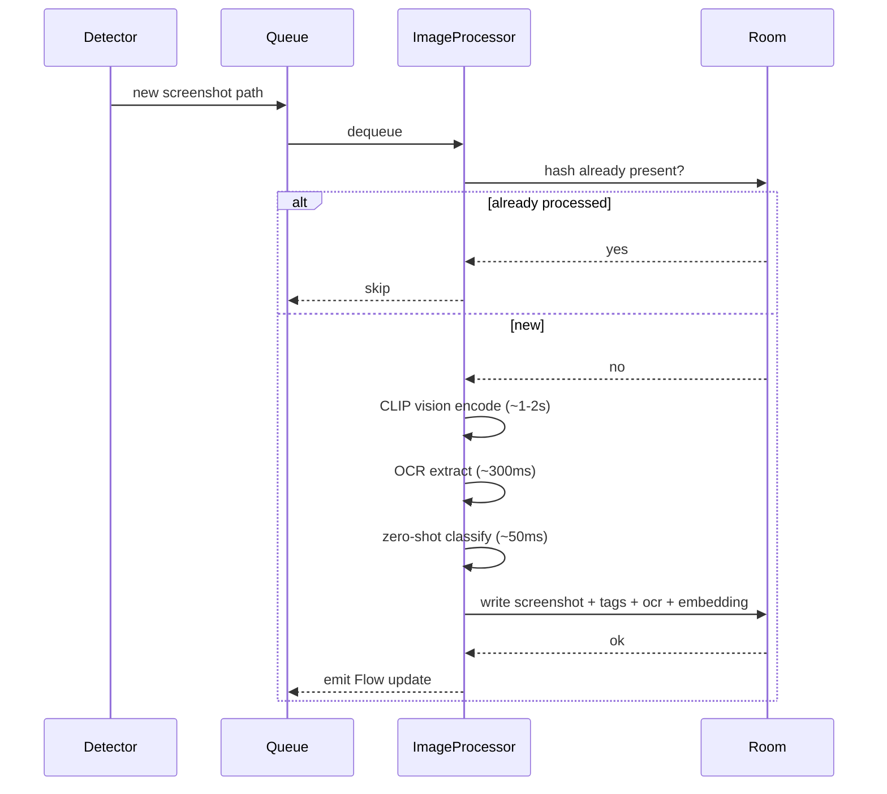
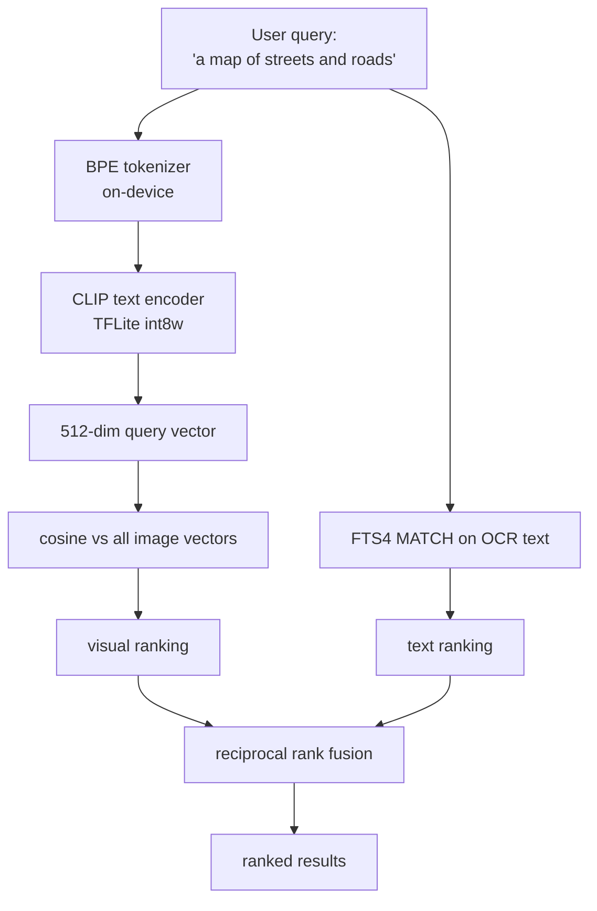
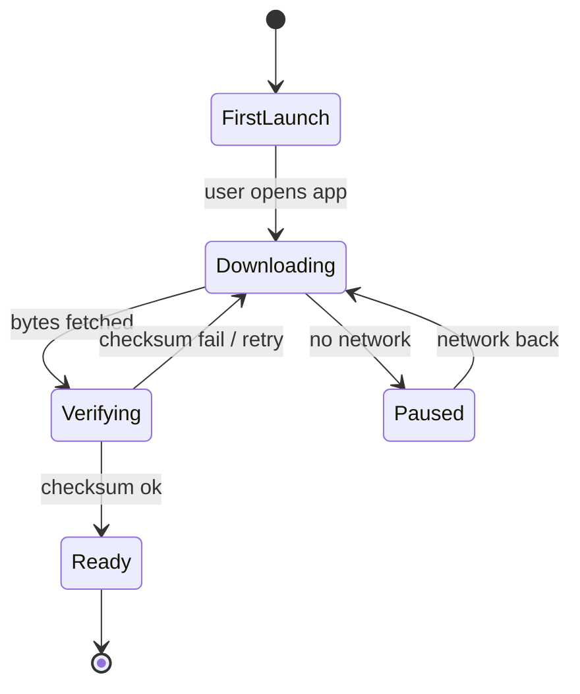
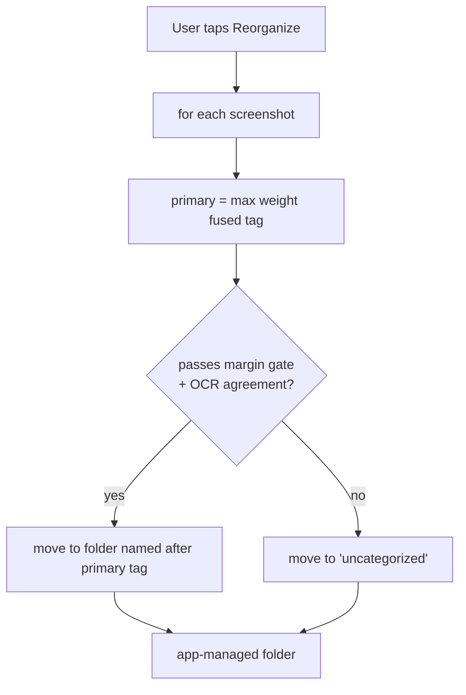

# Screenshot Classifier — Design Document

> Status: Phases 0-4 shipped (latest release v0.6.1)
> Last updated: 2026-06-16
> Owner: mohamed.baeth@okapiorbits.com

> **Update 2026-06-14 (CLIP spike):** A zero-shot spike
> ([docs/spikes/clip-findings.md](spikes/clip-findings.md)) showed CLIP is strong
> on visually distinctive screens (maps, code) but confidently wrong on text-heavy
> and ambiguous UI. CLIP is therefore **not** the sole classifier. OCR is promoted
> to a co-classifier, tagging is gated on margin and OCR agreement rather than raw
> confidence, and LAION-2B weights plus prompt ensembling are the default. Sections
> 4, 6, and 11 reflect this; section 13 tracks the residual risks.

## 1. Overview

An Android app that watches the device's screenshot folders, classifies new images using on-device machine learning, and tags them so they can be found later through semantic search. It works fully offline. No backend, no network calls for inference, no data leaving the device.

The mental model is similar to Immich's machine learning classification, but local-first and scoped to screenshots.

### 1.1 What it does

1. Detects new screenshots automatically (live) and on a periodic schedule (catch-up).
2. Runs each screenshot through three signals: a CLIP vision encoder, OCR text extraction, and a fused classifier that combines CLIP zero-shot scores with OCR-derived signals.
3. Stores per-image metadata, multiple weighted tags, OCR text, and a CLIP embedding in a local database.
4. Lets the user search by visual concept and by text appearing in screenshots ("Python error traceback", "boarding pass", "that chat about rent").
5. Optionally reorganizes files into folders based on the highest-weight tag, on explicit user trigger only.

### 1.2 Hard constraints

| Constraint | Decision |
|---|---|
| Network | Fully offline for all inference and tagging. Network is used only for the one-time CLIP model download on first launch and the optional QR link-preview resolution, which is off by default and, when enabled, manual (per tap) by default. No user content (images, OCR text, embeddings) is ever uploaded; resolution only fetches the page a scanned QR code already points to. |
| Organization model | Tags, not folders. Multiple weighted tags per image. |
| File handling | Non destructive by default. Physical file moves happen only when the user triggers reorganization. |
| Search | Both visual concepts and OCR text. |
| Privacy | All image data, embeddings, and OCR text stay on device. |

## 2. Goals and non-goals

### Goals
- Accurate enough multi-tag classification to make browsing and filtering useful.
- Semantic search that finds images by what they look like and by text inside them.
- Background processing that does not hammer the battery or block the UI.
- A taxonomy that ships with sensible defaults and is extensible by the user.

### Non-goals (for v1)
- Open vocabulary tagging where the model invents brand new labels on its own. See section 6.4.
- Cloud sync or multi device.
- Editing or annotating screenshots.
- Bulk auto-classification of the entire camera roll. (In-app *camera capture* of
  specific real-world things — Phase A, section 15 — is now supported; passive
  scanning of every photo on the device is still out of scope.)

## 3. High-level architecture



### 3.1 Module breakdown

```
app/
├── monitoring/
│   ├── ScreenshotFileObserver      # FileObserver on the screenshots dir
│   └── ScreenshotScanWorker        # WorkManager periodic fallback + batch
│
├── pipeline/
│   ├── ImageProcessor              # orchestrates the three steps below
│   ├── ClipEncoder                 # TFLite CLIP vision + text encoder
│   ├── OcrExtractor                # ML Kit Text Recognition
│   └── ZeroShotClassifier          # softmax over cosine sim vs label embeddings
│
├── data/
│   ├── db/                         # Room + FTS4
│   ├── repository/
│   └── model/                      # Screenshot, Tag, Embedding, OcrEntry
│
├── search/
│   ├── SemanticSearchEngine        # query -> CLIP text embed -> cosine sim
│   └── HybridSearchEngine          # merges vector ranking + FTS4 match via RRF
│
├── reorg/
│   └── FileReorganizer             # optional, user triggered file moves
│
└── ui/
    ├── gallery/                    # grid, filterable by tags
    ├── search/                     # search bar + ranked results
    └── settings/                   # scan interval, manage tags, reorg, model
```

## 4. ML stack

The core decision (revised after the spike): **CLIP is one signal, not the whole classifier.** The vision encoder produces a 512 dimensional vector per image. That vector drives semantic search and contributes zero-shot scores for visually distinctive categories. For text-heavy and ambiguous screens, where the spike showed CLIP is confidently wrong, OCR-derived signals carry the classification. A small fusion step combines the two into the final weighted tags.


### 4.1 Components

| Component | Tech | Approx size | Notes |
|---|---|---|---|
| Vision encoder | CLIP ViT-B/32 vision, TFLite (LAION-2B weights) | ~80 MB | Produces 512-dim image vector. Spike found LAION-2B beats OpenAI weights for this task. |
| Text encoder | CLIP text, TFLite | ~40 MB | Encodes labels (with prompt ensembling) and search queries. Needed at query time and taxonomy setup. |
| OCR | ML Kit Text Recognition v2 | bundled | On-device, multi script. Now a co-classifier, not just a search feed. |
| Image labels | ML Kit Image Labeling | bundled | Optional coarse signal. |

CLIP models are downloaded on first launch. They are too large to bundle in the APK. See section 9.

### 4.2 Why CLIP zero-shot, and why it is not enough alone

CLIP zero-shot gives a score against every candidate label for free, which is the multi-tag behavior we want, and the same embedding powers search, so we still avoid training a custom classifier. But the spike was clear: CLIP is reliable only for screens with a distinctive visual signature (maps near-perfect, source code reliable with prompt ensembling) and is confidently wrong on text-heavy or ambiguous UI (a clock read as video, a file manager as shopping, an article about receipts as a receipt), at 0.5 to 0.97 confidence. High confidence on wrong answers means a confidence floor alone is no protection.

### 4.3 Fusion and gating

- **CLIP-led** for visually distinctive categories: map, photo-like, game, video, social feed.
- **OCR-led** for text-heavy categories: code vs error vs document, finance vs news, calendar, receipt, email, social/forum, and utility screens. These are cheaply separable by keywords and patterns (currency symbols and totals → receipt, stack-trace shapes and Android error strings → error, monospace plus language tokens → code, inbox/subject markers → email). `error / crash` is **OCR-only** (the CLIP error label was removed in v0.6.1 because it fired on any modal dialog — see section 6.1).
- **Margin gate, not confidence floor.** Decide on the top1-minus-top2 margin and whether OCR agrees with CLIP. Low margin or CLIP-OCR disagreement routes the screenshot to "needs review" / "other" instead of attaching a confident wrong tag.
- **Label set.** Use a granular, concrete internal label set (prompt ensembled) and map it onto the user-facing taxonomy. Concrete labels measurably outperformed abstract buckets in the spike.

## 5. Data model



Notes:
- `tags.weight` is the softmax normalized score. Weights sum to roughly 1.0 per image, so they are comparable and "highest weight" is meaningful. See section 6.
- `tags.source` is one of `clip_zero_shot` or `user`.
- `embeddings.vector` is 512 float32 values, 2 KB per image. About 20 MB for 10k images, which fits in memory for brute force search.
- `ocr_entries` is mirrored into an FTS4 virtual table for full text search (recency-ranked MATCH; FTS4 has no BM25, so hybrid search fuses the OCR and visual rankings via RRF — see section 8 and the TODO deviations).
- `file_hash` is used to skip already processed images and to detect duplicates.

## 6. Multi-tag weighting

CLIP outputs a similarity score against every candidate label, not a single winner. That is the multi-tag behavior we want. But there is an important detail.

**Raw CLIP cosine scores are not probabilities and are not comparable across images.** They cluster in a narrow band, often 0.15 to 0.35, and the absolute values drift image to image. Thresholding on raw cosine ("attach every tag above 0.25") produces inconsistent garbage.

The fix is softmax over the label set, per image:

```
scores  = [cosine(image_vec, label_vec) for label in taxonomy]
weights = softmax(scores / temperature)   # temperature ~0.01 for CLIP
```

Now the weights sum to 1.0 across tags for that image, they are comparable, and selecting the top tag is meaningful.

These are the CLIP-side scores. They are then fused with OCR signals (section 4.3) and gated on margin before tags are attached. The spike showed raw softmax weight is not enough: CLIP produced 0.97 weight on wrong tags, so weight alone cannot be the attachment criterion.

Tag attachment rule: after fusion, keep tags above a relative threshold (weight > 0.1) capped at the top 3 to 5, AND require the top tag to clear a margin over the second (top1 - top2 >= margin) or be corroborated by OCR. Anything that fails the margin/OCR check is attached as low-confidence (surfaced for review) rather than treated as settled.



### 6.1 Default taxonomy

These ~16 labels are the user-facing taxonomy. Users can add custom ones (a custom label becomes another prompt-ensembled text embedding scored the same way).

```
social media, receipt, map, code editor, chat / messaging,
document, browser / web, game, shopping, news,
video / streaming, error / crash, calendar, finance, email, other
```

The camera-capture feature (section 15) adds real-world tags scored the same zero-shot
way (embedded with photo-style prompts, not screenshot prompts): `storefront`,
`advertisement`, `street sign`, `business card`, `product`, `menu`, `poster`, and
`qr code`. The `qr code` tag is authoritative when the on-device barcode decoder finds a
code; the CLIP `qr code` label is only a visual backstop.

Internally, classification runs against a finer, concrete label set (for example a
clock app, a contacts list, a phone dialer, a file manager, a settings screen) that
maps onto these user-facing tags. The spike showed concrete labels with prompt
ensembling clearly beat abstract buckets (settings 0.99, contacts 0.96 on LAION
versus scattered guesses for the abstract set).

> **`error / crash` is OCR-only as of v0.6.1.** The eval found CLIP's
> `"an error message dialog"` label fired on *any* modal dialog (0 correct in 80
> predictions), because CLIP cannot visually distinguish an error dialog from a normal
> one. That internal label was remapped to `other`, so error/crash is now produced only by
> the OCR rule (error text is the reliable signal). See
> [docs/eval/performance-and-accuracy.md](eval/performance-and-accuracy.md).

### 6.2 Honest limitation on "the model decides the tags"

CLIP only scores against labels we give it. It will not invent "Spotify now playing" on its own. It picks which of the defined tags apply and how strongly. The taxonomy still matters. Genuinely open vocabulary tagging needs a captioning model like BLIP, which is heavier and lower quality on device. Recommended against for v1.

## 7. Processing flow



- A single new screenshot is processed promptly via a foreground or expedited worker.
- A batch scan (manual trigger, or periodic WorkManager) drains the queue with a progress notification.
- The CLIP text encoder is not needed during image processing. Label embeddings are precomputed once at taxonomy setup and cached.

## 8. Semantic search (implemented in Phase 3)



- Visual search embeds the query with the on-device CLIP text encoder, then runs brute-force cosine similarity against the stored, L2-normalized image vectors (loaded from Room). Same 512-dim space as the image encoder, so cosine is meaningful.
- The query is tokenized by a faithful Kotlin port of open_clip's byte-level BPE tokenizer (`BpeTokenizer`), proven byte-identical to the Python reference by unit tests. The BPE merges are bundled (~1.3 MB).
- Text search uses FTS4 MATCH over OCR text (FTS5/BM25 was not available through Room, see deviations in the TODO).
- **Fusion is reciprocal rank fusion (RRF)**, not the weighted-score merge originally sketched. RRF combines the two rankings by rank position, which sidesteps the incompatible score scales (CLIP cosine ~0.2-0.35 vs a binary FTS hit). It degrades gracefully: no text model installed -> pure OCR results; no OCR match -> pure visual results.
- Brute force ships first. **Measured** (see [docs/spikes/scale-test.md](spikes/scale-test.md)): originally latency was linear and crossed 50 ms between 5k and 10k (~126 ms at 10k) because `SemanticSearcher` re-deserialized every embedding blob from Room on each query. Fixed with `EmbeddingCache`, which decodes the vectors once and reuses them (invalidated on embedding change): warm (repeat) queries are now ~11 ms at 10k, ~22 ms extrapolated at 20k, well under target. Only the first query after the library changes pays the ~126 ms rebuild. Move to an HNSW index only if libraries exceed ~20k. Most users will not hit this.
- **On-device verification (emulator, int8 models):** "a map of streets and roads" -> map 0.274 (next 0.129); "program source code in an editor" -> code 0.234 (next 0.181); "a store receipt with prices and total" -> receipt 0.300 (next 0.111). Clear top-1 separation against distractors.

## 9. Model delivery

CLIP models total about 120 MB, too large for the APK. They download on first launch.



- Show a clear "setting up offline AI" progress screen.
- Verify a checksum after download so a corrupt model does not silently break inference.
- Prefer unmetered network by default, with an override.
- Store models in app internal storage. They never need to be re-downloaded.

## 10. Permissions and platform concerns

- `READ_MEDIA_IMAGES` (Android 13+) or scoped `READ_EXTERNAL_STORAGE` on older versions.
- `POST_NOTIFICATIONS` for batch progress.
- Foreground service or expedited WorkManager for processing so the OS does not kill mid batch.
- FileObserver is unreliable across all OEMs and is killed with the process. WorkManager periodic scan is the reliable backstop. We use both: FileObserver for low latency when alive, WorkManager so nothing is missed.
- Battery: process in batches when charging or idle where possible. Respect Doze.

## 11. Reorganization (optional, user triggered)



- Reorganization only happens on explicit user action (or, if the user opts in, a
  background copy after each scan; the background pass never deletes).
- **As shipped (configurable, 2026-06-14):** the default is a non-destructive COPY into
  `Pictures/<root>/<tag>/`. The user can switch to MOVE (copy then delete originals),
  rename the album root, choose whether needs-review shots go to "uncategorized" or are
  skipped, and enable automatic copying after each scan. Preferences live in DataStore.
- The routing gate is the persisted needs_review flag (margin plus OCR agreement, section
  4.3), NOT a raw confidence floor. The spike proved a floor is useless here: CLIP filed a
  clock as "video" and a file manager as "shopping" at 0.5+ weight, which a 0.4 floor would
  wave straight through. Ambiguous or contradicted images go to "uncategorized" instead.
- MOVE is destructive and scoped storage will not let the app delete media it does not own
  silently, so a move asks the user to approve the deletion via `MediaStore.createDeleteRequest`
  (API 30+; below that MOVE degrades to COPY). Every move is recorded in an undo log
  (`reorg_moves`) so it can be reversed: the album copy is restored to the original location.
- The album copies are app-managed entries the app has full access to. After a move the DB
  repoints each screenshot at its album copy, so thumbnails and search keep working.

## 12. Performance targets (mid-range device)

| Step | Target |
|---|---|
| CLIP vision encode | 1 to 2 s per image |
| OCR extract | ~300 ms per image |
| Zero-shot classify | ~50 ms per image |
| Semantic search (10k images) | < 50 ms (target) / **~11 ms warm, ~126 ms cold-rebuild measured** |
| Memory for vectors (10k) | ~20 MB (**19.5 MB measured**) |
| OCR-only classify | **21.9 ms/image measured** (emulator) |

These were estimates; the **measured** column comes from the 2026-06-14 scale test
([docs/spikes/scale-test.md](spikes/scale-test.md)). With the `EmbeddingCache`, warm
(repeat) searches meet target to 10k and beyond; only the first query after the library
changes pays the full decode (see section 8). Memory estimate held. The CLIP vision
encode still dominates a full re-embed and is the next thing to benchmark.

## 13. Open risks

1. ~~On-device CLIP quality on screenshots.~~ **Tested (spike, 2026-06-14).** Confirmed out of distribution on text-heavy UI. Mitigated by the OCR co-classifier and margin gating (sections 4.3, 6, 11). Residual: the fusion and gate logic itself is unbuilt and unproven, and the spike set was small (11 images, several categories stood in by web consent walls).
2. ~~TFLite CLIP port quality and availability.~~ **Resolved (Phases 2-3, 2026-06-14).** Both encoders converted from open_clip ViT-B/32 LAION-2B via litert-torch, int8 weight-only. Image encoder cosine >=0.998 vs PyTorch; text encoder min cosine 0.9993. Both verified running in Android's TFLite runtime, and cross-modal retrieval confirmed on-device (section 8). Quantization cost is negligible for ranking.
3. FileObserver reliability across OEMs. Mitigated by the WorkManager backstop.
4. Battery and thermal during large initial backfill (first scan of an existing screenshot library of thousands of images).
5. A UI-domain model (SigLIP, or CLIP fine-tuned on RICO / Screen2Words) would likely beat generic CLIP on the screens where it failed. Candidate for a follow-up spike; costs more on-device size and complexity.

## 14. Phased plan

- **Phase 0 (done, v0.1.0)**: Project scaffold, Room schema, permissions, basic gallery reading from MediaStore.
- **Phase 1 (done, v0.2.0)**: OCR pipeline + FTS4 text search. Useful on its own and validates the queue and background work.
- **Phase 2 (done, v0.3.0)**: CLIP image encoder, model download, embeddings, zero-shot tagging fused with OCR.
- **Phase 3 (done, v0.4.0)**: Free-text visual + hybrid semantic search (CLIP text encoder + on-device BPE tokenizer + RRF fusion).
- **Phase 4 (done, v0.5.0)**: Settings screen, reprocess action, custom user tags — manual per-image tags + user-defined auto-categories scored by an independent cosine threshold, a "needs review" surface for low-confidence/contradicted tags, and configurable user-triggered reorganization. Also cleared standing debt: OCR min-score floor, foreground-service processing.
- **v0.6.0**: email/reddit OCR fix, configurable multi-folder watching, new icon + brand, release signing / AAB, and a large on-device classification eval (see below).
- **v0.6.1**: error/crash classification fix (CLIP error label was firing on any modal dialog; remapped to `other`, error/crash is now OCR-only).
- **Camera capture, Phase A (in development)**: in-app camera capture of real-world
  things (storefronts, signs, ads, QR codes) classified into the same inventory as
  screenshots. Fully offline. See section 15. Phase B (link-preview resolution for QR
  URLs; optional generative description) is deferred — see TODO.md.

**Measured quality and performance.** A repeatable on-device eval harness
(`ClassificationEvalTest`) runs the exact production path over ~3,380 real screenshots
(F-Droid, Enrico, a clean field slice, and a real-bank slice) plus instrumented scale and
throughput tests. Full findings, charts, and honest caveats:
[docs/eval/performance-and-accuracy.md](eval/performance-and-accuracy.md). Headlines:
precision is strong on confident visual classes (game/finance/map/video 68-88%); the app
abstains rather than mislabel; OCR fusion is mildly net-positive on the confound-free signal;
search is ~11 ms warm at 10k images after the embedding cache.

Phase 1 ships value without the heavy CLIP dependency and de-risks the background processing machinery before adding the big model.

Note on classification: CLIP is one signal, not the sole classifier. Per the spike (docs/spikes/clip-findings.md) it is confidently wrong on text-heavy/ambiguous UI, so OCR co-classifies text-heavy categories and tagging gates on the top1-top2 margin plus OCR agreement rather than a raw confidence floor. Custom user auto-categories are additive (independent cosine threshold) and never alter the built-in scoring.

## 15. Camera capture inventory (real-world things)

Extends the app from screenshots to photos the user takes in-app of real-world things:
storefronts, street signs, advertisements, business cards, products, menus, posters, and
QR codes. These land in the same gallery/search/tag inventory as screenshots. The whole
feature is split so the only network-touching part is isolated and deferred.

**Why this fits the existing pipeline.** `ImageProcessor` was already source-agnostic
(it runs on any image URI), and CLIP's bundled prompts include photo-style templates, so
real-world photos reuse OCR + CLIP + the margin gate unchanged. The added pieces are
small.

### 15.1 Phase A (built, fully offline)

1. **Capture (CameraX).** A full-screen camera (`ui/camera/CameraCaptureScreen`) writes
   each photo to the user's gallery at `Pictures/ScreenshotClassifier/Captures` via
   MediaStore (so the user owns the file and it gets a real `media_store_id`), then hands
   it to `ScreenshotRepository.indexCapture`, which inserts a `source_type = CAMERA` row
   directly (bypassing the watched-folder scan) and enqueues the existing processing worker.
2. **`source_type` column.** `ScreenshotEntity` gains `source_type` (`SCREENSHOT` /
   `CAMERA`), plus `description` and `qr_payload` for captures (DB v6, destructive migration
   consistent with prior bumps). The gallery shows an All / Screenshots / Photos filter once
   any capture exists.
3. **QR / barcode decode (offline).** For camera captures only, `BarcodeExtractor` (ML Kit
   Barcode Scanning, on-device) decodes any code. A decoded code is treated as ground truth:
   an authoritative `qr code` tag is attached, the raw payload stored, and the capture is
   not flagged needs-review. Decoding never fetches what a URL points to.
4. **Structured description.** `CaptureDescriber` (interface; `StructuredCaptureDescriber`
   impl) composes a short, deterministic description from OCR text, the top tags, and any QR
   payload (for a URL it names the host, not the full tracking URL), stored in `description`
   and shown on the detail screen.

**Why the screenshot eval is preserved (by construction, not by luck).** Adding labels to a
zero-shot softmax can change the argmax for any image even if no existing embedding moved,
because the new labels are new competitors. Two things together prevent that for screenshots:
(1) the 22 original label embedding rows are byte-identical — the real-world rows were
*appended*, not regenerated (`spikes/clip/add_realworld_labels.py`, verified by sha of the
file head); and (2) `ZeroShotClassifier.classify` scores screenshots against
`ClipLabels.screenshotLabels` (the original 22) and only camera captures opt into the full
30 via `includeRealWorld = true`. So a screenshot's candidate set and softmax denominator
are exactly what they were, and the eval harness (which calls `classify` with the default)
is unchanged. Barcode decode and description are likewise gated to captures.

Real-world classification (CLIP visual classes for storefront/sign/etc.) is unvalidated —
there is no labeled real-world capture dataset and the eval emulator has no CLIP model. The
QR path is validated end-to-end on device (`CameraCapturePipelineTest`).

### 15.2 Phase B — QR link-preview resolution (built)

The only network-touching part of the feature, and it is **off by default**. When the user
enables it (Settings > Camera capture), a scanned URL can be resolved into a preview card
showing the page's OpenGraph metadata (title, description, og:image).

- **Configurable and offline-first.** `CapturePreferences` (DataStore) controls everything:
  resolve on/off (default off), manual vs automatic trigger (default manual), Wi-Fi-only
  (default on), and whether the og:image is loaded (default off). Defaults never touch the
  network on their own.
- **One shared, pure gate.** `ResolvePolicy.decide(prefs, isUrl, network)` is the single
  decision point (off → no fetch; non-URL → no fetch; Wi-Fi-only on a metered link → no
  fetch), used by both the manual "Resolve link" button (`ScreenshotDetailScreen`) and the
  worker's automatic path. Unit-tested without a network.
- **Conservative fetch.** `LinkPreviewResolver` uses `HttpURLConnection` (no new dependency)
  with an http/https allowlist re-checked after each redirect, a LAN-host guard, timeouts, a
  byte cap, and a content-type check; it swallows all failures so a bad URL never fails a
  batch. `OgParser` extracts the metadata by regex (no HTML-parser dependency) and is
  unit-tested. The og:image URL is stored as a string; whether it is actually loaded is gated
  at the render site by `downloadPreviewImages`, so that toggle genuinely controls the fetch.

> **Correction of a Phase A statement.** Phase A docs said resolution would be "an explicit
> action you tap, never an automatic fetch." That was too absolute. Resolution is off by
> default and manual by default, but the comprehensive-config requirement added an opt-in
> automatic trigger. The default behavior still never reaches the network on its own.

### 15.3 Generative description (experimental, in progress)

A second `CaptureDescriber` impl backed by an on-device vision-language model, swappable
without touching the pipeline or the `description` column. Researched and scaffolded
2026-06-17; see [docs/spikes/vlm-device-research.md](spikes/vlm-device-research.md).

- **Runtime/model:** MediaPipe LLM Inference (`com.google.mediapipe:tasks-genai`) + Gemma 3n
  E2B (multimodal, ~3.1 GB download, ~5.9 GB peak). High-end only: the API is documented as
  for Pixel 8 / Samsung S23-class devices and "does not reliably support device emulators."
- **Built so far (verifiable):** a pure device-capability gate (`DeviceCapability`, unit-tested:
  arm64 + ~7 GB+ total RAM + not low-RAM + not emulator) and the experimental, opt-in Settings
  config — the `GENERATIVE` selector is labeled experimental and stays disabled with a
  device-aware reason (capability reason, or "model not downloadable yet" on a capable device).
- **Blocked, not built (needs decisions):** the `tasks-genai` dependency, the
  `GenerativeCaptureDescriber` (LlmInference + vision session), and the model download. These
  cannot be verified in our environment (emulator unsupported; no high-end device), the 3.1 GB
  model exceeds the 2 GB GitHub-release limit our mirror uses, and Gemma's license governs
  redistribution. Open decisions: where to host/download the model, license handling, and a real
  device for verification. Until then the offline structured describer remains the only path.

### 15.4 Still deferred

- **Real-world classification eval.** Validating CLIP accuracy on storefront/sign/product
  captures needs a labeled real-world dataset and the CLIP model on the eval device.

See TODO.md for the remaining task list.
