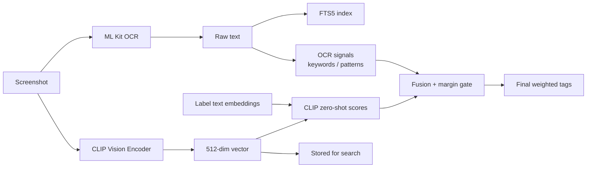
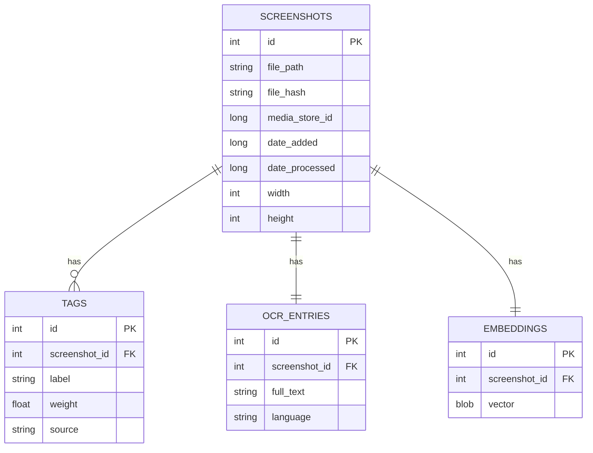
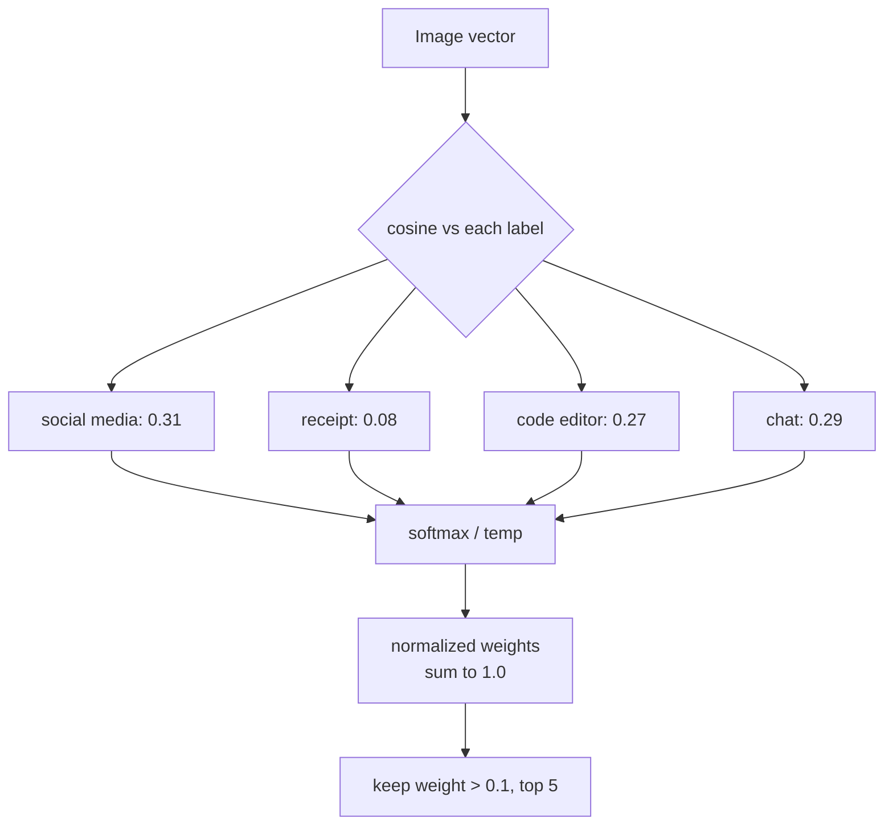
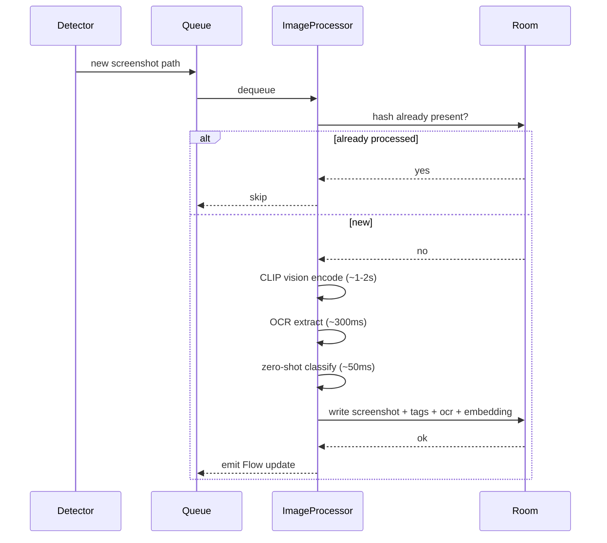
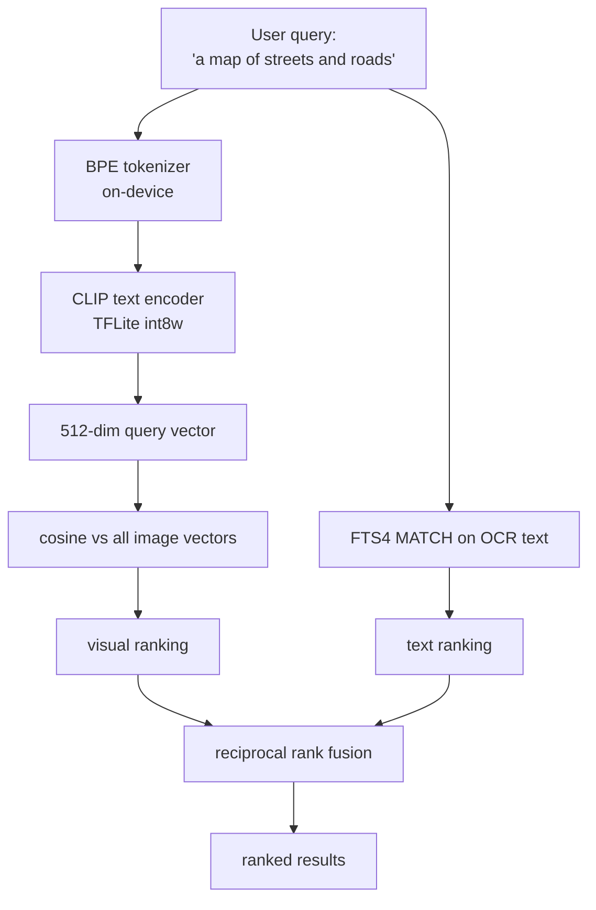
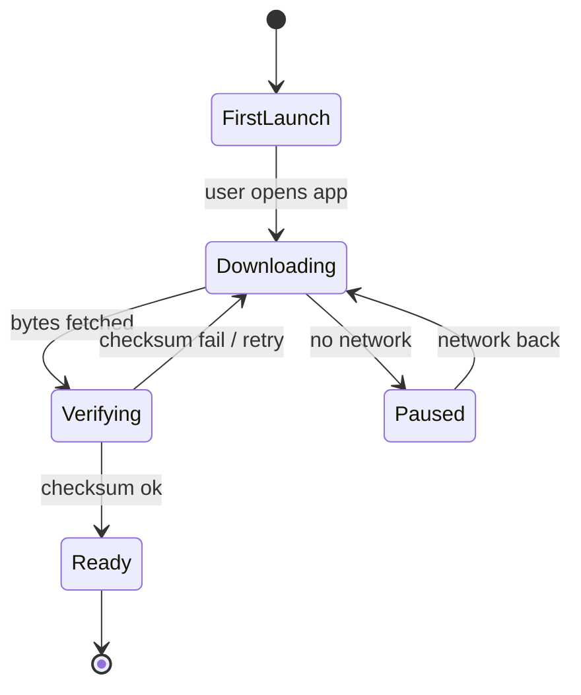
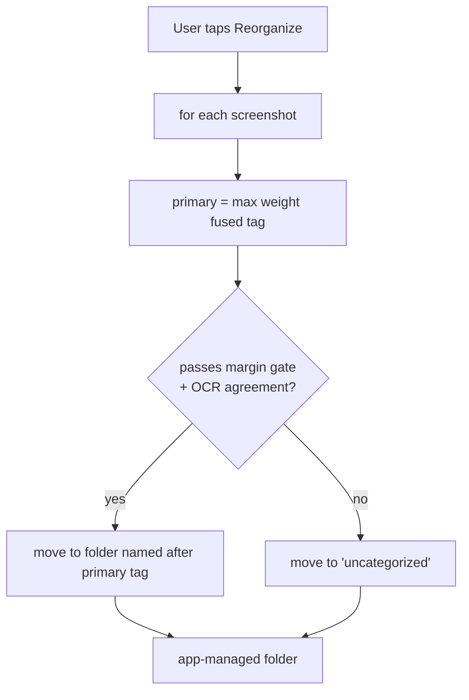

# Screenshot Classifier — Design Document

> Status: Draft / Planning
> Last updated: 2026-06-14
> Owner: mohamed.baeth@okapiorbits.com

> **Update 2026-06-14 (CLIP spike):** A zero-shot spike
> ([docs/spikes/clip-findings.md](spikes/clip-findings.md)) showed CLIP is strong
> on visually distinctive screens (maps, code) but confidently wrong on text-heavy
> and ambiguous UI. CLIP is therefore **not** the sole classifier. OCR is promoted
> to a co-classifier, tagging is gated on margin and OCR agreement rather than raw
> confidence, and LAION-2B weights plus prompt ensembling are the default. Sections
> 4, 6, and 11 reflect this; section 13 tracks the residual risks.

## 1. Overview

An Android app that watches the device's screenshot folders, classifies new images using on-device machine learning, and tags them so they can be found later through semantic search. It works fully offline. No backend, no network calls for inference, no data leaving the device.

The mental model is similar to Immich's machine learning classification, but local-first and scoped to screenshots.

### 1.1 What it does

1. Detects new screenshots automatically (live) and on a periodic schedule (catch-up).
2. Runs each screenshot through three signals: a CLIP vision encoder, OCR text extraction, and a fused classifier that combines CLIP zero-shot scores with OCR-derived signals.
3. Stores per-image metadata, multiple weighted tags, OCR text, and a CLIP embedding in a local database.
4. Lets the user search by visual concept and by text appearing in screenshots ("Python error traceback", "boarding pass", "that chat about rent").
5. Optionally reorganizes files into folders based on the highest-weight tag, on explicit user trigger only.

### 1.2 Hard constraints

| Constraint | Decision |
|---|---|
| Network | Fully offline for all inference. The only network use is the one time CLIP model download on first launch. |
| Organization model | Tags, not folders. Multiple weighted tags per image. |
| File handling | Non destructive by default. Physical file moves happen only when the user triggers reorganization. |
| Search | Both visual concepts and OCR text. |
| Privacy | All image data, embeddings, and OCR text stay on device. |

## 2. Goals and non-goals

### Goals
- Accurate enough multi-tag classification to make browsing and filtering useful.
- Semantic search that finds images by what they look like and by text inside them.
- Background processing that does not hammer the battery or block the UI.
- A taxonomy that ships with sensible defaults and is extensible by the user.

### Non-goals (for v1)
- Open vocabulary tagging where the model invents brand new labels on its own. See section 6.4.
- Cloud sync or multi device.
- Editing or annotating screenshots.
- Classifying non screenshot images (general camera roll). Could come later.

## 3. High-level architecture


### 3.1 Module breakdown

```
app/
├── monitoring/
│   ├── ScreenshotFileObserver      # FileObserver on the screenshots dir
│   └── ScreenshotScanWorker        # WorkManager periodic fallback + batch
│
├── pipeline/
│   ├── ImageProcessor              # orchestrates the three steps below
│   ├── ClipEncoder                 # TFLite CLIP vision + text encoder
│   ├── OcrExtractor                # ML Kit Text Recognition
│   └── ZeroShotClassifier          # softmax over cosine sim vs label embeddings
│
├── data/
│   ├── db/                         # Room + FTS5
│   ├── repository/
│   └── model/                      # Screenshot, Tag, Embedding, OcrEntry
│
├── search/
│   ├── SemanticSearchEngine        # query -> CLIP text embed -> cosine sim
│   └── HybridSearchEngine          # merges vector score + FTS5 BM25 score
│
├── reorg/
│   └── FileReorganizer             # optional, user triggered file moves
│
└── ui/
    ├── gallery/                    # grid, filterable by tags
    ├── search/                     # search bar + ranked results
    └── settings/                   # scan interval, manage tags, reorg, model
```

## 4. ML stack

The core decision (revised after the spike): **CLIP is one signal, not the whole classifier.** The vision encoder produces a 512 dimensional vector per image. That vector drives semantic search and contributes zero-shot scores for visually distinctive categories. For text-heavy and ambiguous screens, where the spike showed CLIP is confidently wrong, OCR-derived signals carry the classification. A small fusion step combines the two into the final weighted tags.



### 4.1 Components

| Component | Tech | Approx size | Notes |
|---|---|---|---|
| Vision encoder | CLIP ViT-B/32 vision, TFLite (LAION-2B weights) | ~80 MB | Produces 512-dim image vector. Spike found LAION-2B beats OpenAI weights for this task. |
| Text encoder | CLIP text, TFLite | ~40 MB | Encodes labels (with prompt ensembling) and search queries. Needed at query time and taxonomy setup. |
| OCR | ML Kit Text Recognition v2 | bundled | On-device, multi script. Now a co-classifier, not just a search feed. |
| Image labels | ML Kit Image Labeling | bundled | Optional coarse signal. |

CLIP models are downloaded on first launch. They are too large to bundle in the APK. See section 9.

### 4.2 Why CLIP zero-shot, and why it is not enough alone

CLIP zero-shot gives a score against every candidate label for free, which is the multi-tag behavior we want, and the same embedding powers search, so we still avoid training a custom classifier. But the spike was clear: CLIP is reliable only for screens with a distinctive visual signature (maps near-perfect, source code reliable with prompt ensembling) and is confidently wrong on text-heavy or ambiguous UI (a clock read as video, a file manager as shopping, an article about receipts as a receipt), at 0.5 to 0.97 confidence. High confidence on wrong answers means a confidence floor alone is no protection.

### 4.3 Fusion and gating

- **CLIP-led** for visually distinctive categories: map, photo-like, game, video, social feed.
- **OCR-led** for text-heavy categories: code vs error vs document, finance vs news, calendar, receipt, and utility screens. These are cheaply separable by keywords and patterns (currency symbols and totals → receipt, stack-trace shapes → error, monospace plus language tokens → code).
- **Margin gate, not confidence floor.** Decide on the top1-minus-top2 margin and whether OCR agrees with CLIP. Low margin or CLIP-OCR disagreement routes the screenshot to "needs review" / "other" instead of attaching a confident wrong tag.
- **Label set.** Use a granular, concrete internal label set (prompt ensembled) and map it onto the user-facing taxonomy. Concrete labels measurably outperformed abstract buckets in the spike.

## 5. Data model



Notes:
- `tags.weight` is the softmax normalized score. Weights sum to roughly 1.0 per image, so they are comparable and "highest weight" is meaningful. See section 6.
- `tags.source` is one of `clip_zero_shot` or `user`.
- `embeddings.vector` is 512 float32 values, 2 KB per image. About 20 MB for 10k images, which fits in memory for brute force search.
- `ocr_entries` is mirrored into an FTS5 virtual table for full text search with BM25 ranking.
- `file_hash` is used to skip already processed images and to detect duplicates.

## 6. Multi-tag weighting

CLIP outputs a similarity score against every candidate label, not a single winner. That is the multi-tag behavior we want. But there is an important detail.

**Raw CLIP cosine scores are not probabilities and are not comparable across images.** They cluster in a narrow band, often 0.15 to 0.35, and the absolute values drift image to image. Thresholding on raw cosine ("attach every tag above 0.25") produces inconsistent garbage.

The fix is softmax over the label set, per image:

```
scores  = [cosine(image_vec, label_vec) for label in taxonomy]
weights = softmax(scores / temperature)   # temperature ~0.01 for CLIP
```

Now the weights sum to 1.0 across tags for that image, they are comparable, and selecting the top tag is meaningful.

These are the CLIP-side scores. They are then fused with OCR signals (section 4.3) and gated on margin before tags are attached. The spike showed raw softmax weight is not enough: CLIP produced 0.97 weight on wrong tags, so weight alone cannot be the attachment criterion.

Tag attachment rule: after fusion, keep tags above a relative threshold (weight > 0.1) capped at the top 3 to 5, AND require the top tag to clear a margin over the second (top1 - top2 >= margin) or be corroborated by OCR. Anything that fails the margin/OCR check is attached as low-confidence (surfaced for review) rather than treated as settled.



### 6.1 Default taxonomy

These ~15 labels are the user-facing taxonomy. Users can add custom ones (a custom label becomes another prompt-ensembled text embedding scored the same way).

```
social media, receipt, map, code editor, chat / messaging,
document, browser / web, game, shopping, news,
video / streaming, error / crash, calendar, finance, other
```

Internally, classification runs against a finer, concrete label set (for example a
clock app, a contacts list, a phone dialer, a file manager, a settings screen) that
maps onto these user-facing tags. The spike showed concrete labels with prompt
ensembling clearly beat abstract buckets (settings 0.99, contacts 0.96 on LAION
versus scattered guesses for the abstract set).

### 6.2 Honest limitation on "the model decides the tags"

CLIP only scores against labels we give it. It will not invent "Spotify now playing" on its own. It picks which of the defined tags apply and how strongly. The taxonomy still matters. Genuinely open vocabulary tagging needs a captioning model like BLIP, which is heavier and lower quality on device. Recommended against for v1.

## 7. Processing flow



- A single new screenshot is processed promptly via a foreground or expedited worker.
- A batch scan (manual trigger, or periodic WorkManager) drains the queue with a progress notification.
- The CLIP text encoder is not needed during image processing. Label embeddings are precomputed once at taxonomy setup and cached.

## 8. Semantic search (implemented in Phase 3)



- Visual search embeds the query with the on-device CLIP text encoder, then runs brute-force cosine similarity against the stored, L2-normalized image vectors (loaded from Room). Same 512-dim space as the image encoder, so cosine is meaningful.
- The query is tokenized by a faithful Kotlin port of open_clip's byte-level BPE tokenizer (`BpeTokenizer`), proven byte-identical to the Python reference by unit tests. The BPE merges are bundled (~1.3 MB).
- Text search uses FTS4 MATCH over OCR text (FTS5/BM25 was not available through Room, see deviations in the TODO).
- **Fusion is reciprocal rank fusion (RRF)**, not the weighted-score merge originally sketched. RRF combines the two rankings by rank position, which sidesteps the incompatible score scales (CLIP cosine ~0.2-0.35 vs a binary FTS hit). It degrades gracefully: no text model installed -> pure OCR results; no OCR match -> pure visual results.
- Brute force is fine up to roughly 20k images (about 40 MB of vectors, a few milliseconds per query). Above that, move to an HNSW index. Most users will not hit this, so brute force ships first.
- **On-device verification (emulator, int8 models):** "a map of streets and roads" -> map 0.274 (next 0.129); "program source code in an editor" -> code 0.234 (next 0.181); "a store receipt with prices and total" -> receipt 0.300 (next 0.111). Clear top-1 separation against distractors.

## 9. Model delivery

CLIP models total about 120 MB, too large for the APK. They download on first launch.



- Show a clear "setting up offline AI" progress screen.
- Verify a checksum after download so a corrupt model does not silently break inference.
- Prefer unmetered network by default, with an override.
- Store models in app internal storage. They never need to be re-downloaded.

## 10. Permissions and platform concerns

- `READ_MEDIA_IMAGES` (Android 13+) or scoped `READ_EXTERNAL_STORAGE` on older versions.
- `POST_NOTIFICATIONS` for batch progress.
- Foreground service or expedited WorkManager for processing so the OS does not kill mid batch.
- FileObserver is unreliable across all OEMs and is killed with the process. WorkManager periodic scan is the reliable backstop. We use both: FileObserver for low latency when alive, WorkManager so nothing is missed.
- Battery: process in batches when charging or idle where possible. Respect Doze.

## 11. Reorganization (optional, user triggered)



- Moves only happen on explicit user action.
- The gate is margin plus OCR agreement (section 4.3), NOT a raw confidence floor. The spike proved a floor is useless here: CLIP filed a clock as "video" and a file manager as "shopping" at 0.5+ weight, which a 0.4 floor would wave straight through. Ambiguous or contradicted images go to "uncategorized" instead.
- Files move into an app-managed folder the app has full access to.
- The DB keeps tracking files by hash and updated path, so search keeps working after a move.

## 12. Performance targets (mid-range device)

| Step | Target |
|---|---|
| CLIP vision encode | 1 to 2 s per image |
| OCR extract | ~300 ms per image |
| Zero-shot classify | ~50 ms per image |
| Semantic search (10k images) | < 50 ms |
| Memory for vectors (10k) | ~20 MB |

These are estimates to validate early on real hardware. The vision encode dominates and is the thing to benchmark first.

## 13. Open risks

1. ~~On-device CLIP quality on screenshots.~~ **Tested (spike, 2026-06-14).** Confirmed out of distribution on text-heavy UI. Mitigated by the OCR co-classifier and margin gating (sections 4.3, 6, 11). Residual: the fusion and gate logic itself is unbuilt and unproven, and the spike set was small (11 images, several categories stood in by web consent walls).
2. ~~TFLite CLIP port quality and availability.~~ **Resolved (Phases 2-3, 2026-06-14).** Both encoders converted from open_clip ViT-B/32 LAION-2B via litert-torch, int8 weight-only. Image encoder cosine >=0.998 vs PyTorch; text encoder min cosine 0.9993. Both verified running in Android's TFLite runtime, and cross-modal retrieval confirmed on-device (section 8). Quantization cost is negligible for ranking.
3. FileObserver reliability across OEMs. Mitigated by the WorkManager backstop.
4. Battery and thermal during large initial backfill (first scan of an existing screenshot library of thousands of images).
5. A UI-domain model (SigLIP, or CLIP fine-tuned on RICO / Screen2Words) would likely beat generic CLIP on the screens where it failed. Candidate for a follow-up spike; costs more on-device size and complexity.

## 14. Phased plan

- **Phase 0 (done, v0.1.0)**: Project scaffold, Room schema, permissions, basic gallery reading from MediaStore.
- **Phase 1 (done, v0.2.0)**: OCR pipeline + FTS4 text search. Useful on its own and validates the queue and background work.
- **Phase 2 (done, v0.3.0)**: CLIP image encoder, model download, embeddings, zero-shot tagging fused with OCR.
- **Phase 3 (done, v0.4.0)**: Free-text visual + hybrid semantic search (CLIP text encoder + on-device BPE tokenizer + RRF fusion).
- **Phase 4 (in progress)**: Settings screen (done), reprocess action (done), custom user tags — manual per-image tags + user-defined auto-categories scored by an independent cosine threshold (done), a "needs review" surface for low-confidence/contradicted tags (done), and user-triggered reorganization. Also clears standing debt: OCR min-score floor, foreground-service processing.

Phase 1 ships value without the heavy CLIP dependency and de-risks the background processing machinery before adding the big model.

Note on classification: CLIP is one signal, not the sole classifier. Per the spike (docs/spikes/clip-findings.md) it is confidently wrong on text-heavy/ambiguous UI, so OCR co-classifies text-heavy categories and tagging gates on the top1-top2 margin plus OCR agreement rather than a raw confidence floor. Custom user auto-categories are additive (independent cosine threshold) and never alter the built-in scoring.
