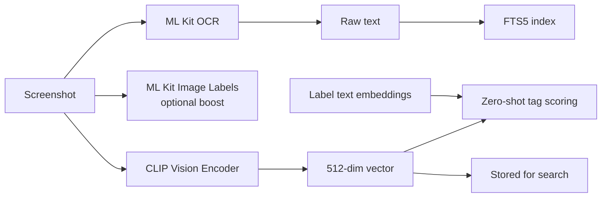
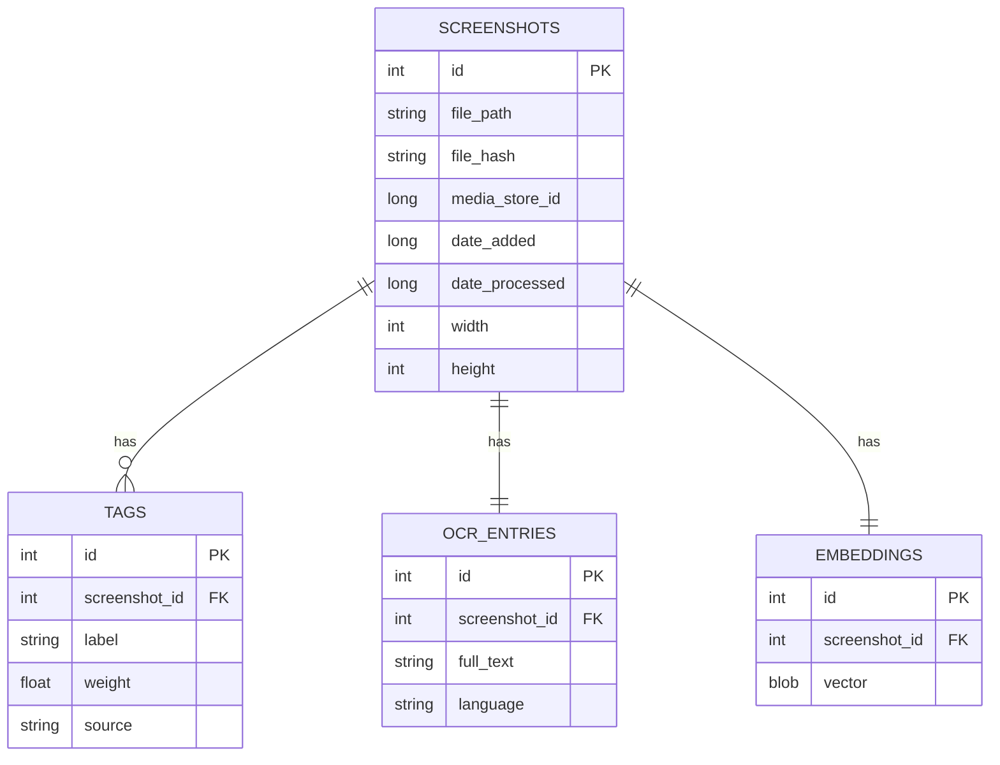
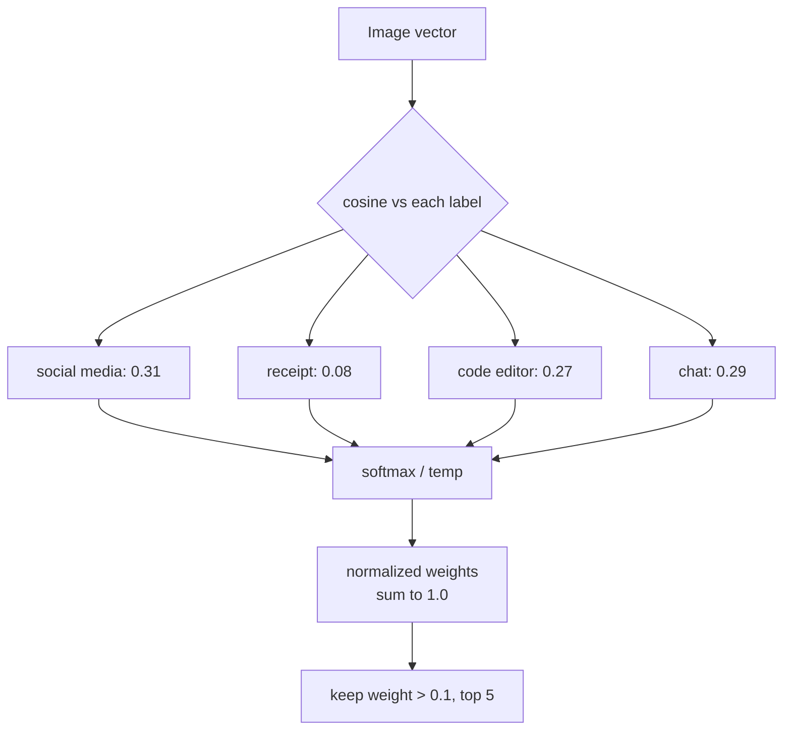
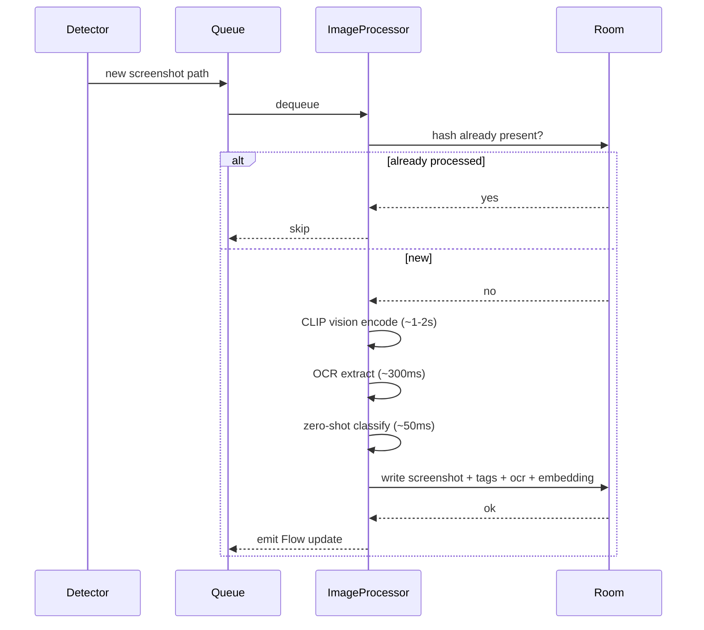
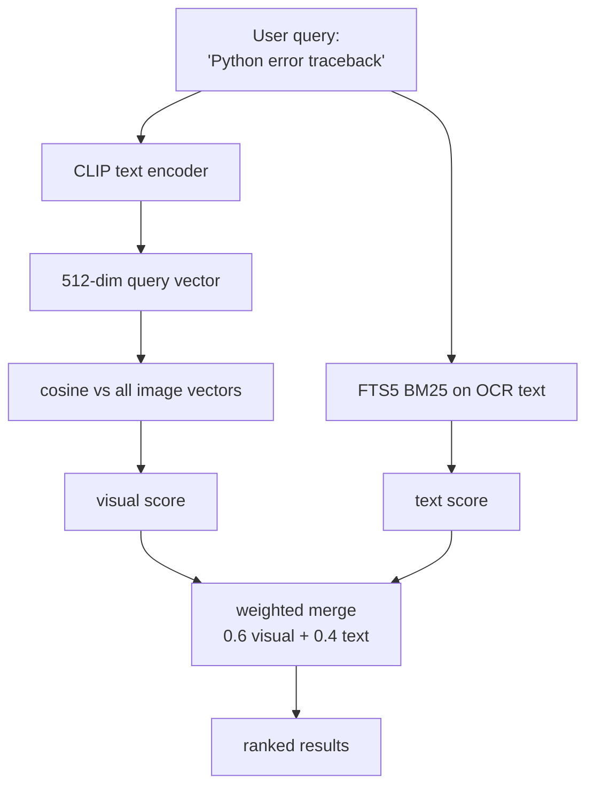
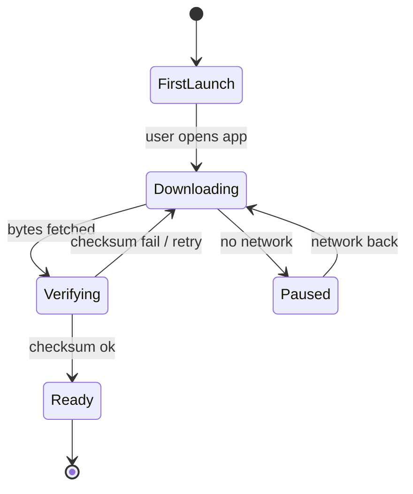
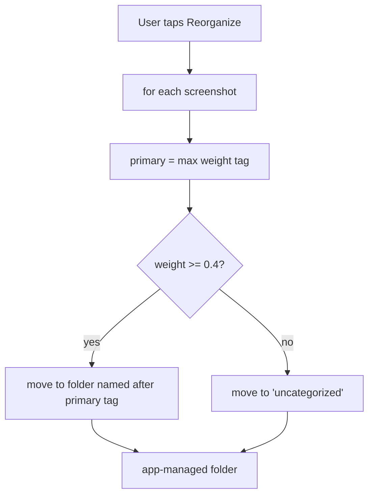

# Screenshot Classifier — Design Document

> Status: Draft / Planning
> Last updated: 2026-06-14
> Owner: mohamed.baeth@okapiorbits.com

## 1. Overview

An Android app that watches the device's screenshot folders, classifies new images using on-device machine learning, and tags them so they can be found later through semantic search. It works fully offline. No backend, no network calls for inference, no data leaving the device.

The mental model is similar to Immich's machine learning classification, but local-first and scoped to screenshots.

### 1.1 What it does

1. Detects new screenshots automatically (live) and on a periodic schedule (catch-up).
2. Runs each screenshot through three signals: a CLIP vision encoder, OCR text extraction, and zero-shot tag classification.
3. Stores per-image metadata, multiple weighted tags, OCR text, and a CLIP embedding in a local database.
4. Lets the user search by visual concept and by text appearing in screenshots ("Python error traceback", "boarding pass", "that chat about rent").
5. Optionally reorganizes files into folders based on the highest-weight tag, on explicit user trigger only.

### 1.2 Hard constraints

| Constraint | Decision |
|---|---|
| Network | Fully offline for all inference. The only network use is the one time CLIP model download on first launch. |
| Organization model | Tags, not folders. Multiple weighted tags per image. |
| File handling | Non destructive by default. Physical file moves happen only when the user triggers reorganization. |
| Search | Both visual concepts and OCR text. |
| Privacy | All image data, embeddings, and OCR text stay on device. |

## 2. Goals and non-goals

### Goals
- Accurate enough multi-tag classification to make browsing and filtering useful.
- Semantic search that finds images by what they look like and by text inside them.
- Background processing that does not hammer the battery or block the UI.
- A taxonomy that ships with sensible defaults and is extensible by the user.

### Non-goals (for v1)
- Open vocabulary tagging where the model invents brand new labels on its own. See section 6.4.
- Cloud sync or multi device.
- Editing or annotating screenshots.
- Classifying non screenshot images (general camera roll). Could come later.

## 3. High-level architecture


### 3.1 Module breakdown

```
app/
├── monitoring/
│   ├── ScreenshotFileObserver      # FileObserver on the screenshots dir
│   └── ScreenshotScanWorker        # WorkManager periodic fallback + batch
│
├── pipeline/
│   ├── ImageProcessor              # orchestrates the three steps below
│   ├── ClipEncoder                 # TFLite CLIP vision + text encoder
│   ├── OcrExtractor                # ML Kit Text Recognition
│   └── ZeroShotClassifier          # softmax over cosine sim vs label embeddings
│
├── data/
│   ├── db/                         # Room + FTS5
│   ├── repository/
│   └── model/                      # Screenshot, Tag, Embedding, OcrEntry
│
├── search/
│   ├── SemanticSearchEngine        # query -> CLIP text embed -> cosine sim
│   └── HybridSearchEngine          # merges vector score + FTS5 BM25 score
│
├── reorg/
│   └── FileReorganizer             # optional, user triggered file moves
│
└── ui/
    ├── gallery/                    # grid, filterable by tags
    ├── search/                     # search bar + ranked results
    └── settings/                   # scan interval, manage tags, reorg, model
```

## 4. ML stack

The core decision: **CLIP zero-shot classification handles both tagging and semantic search with one model.** The vision encoder produces a 512 dimensional vector per image. That same vector is used for tag scoring (compared against text encoded labels) and for visual search (compared against text encoded queries). We do not train a separate classifier.



### 4.1 Components

| Component | Tech | Approx size | Notes |
|---|---|---|---|
| Vision encoder | CLIP ViT-B/32 vision, TFLite | ~80 MB | Produces 512-dim image vector. |
| Text encoder | CLIP text, TFLite | ~40 MB | Encodes labels and search queries. Only needed at query time and at taxonomy setup. |
| OCR | ML Kit Text Recognition v2 | bundled | On-device, multi script. |
| Image labels | ML Kit Image Labeling | bundled | Optional coarse signal, not the primary classifier. |

CLIP models are downloaded on first launch. They are too large to bundle in the APK. See section 9.

### 4.2 Why CLIP and not a trained classifier

A fine tuned MobileNet would give one label per image and would need training data we do not have. CLIP zero-shot gives a score against every candidate label for free, which is exactly the multi-tag behavior we want, and the same embedding powers search. The tradeoff is model size and slightly slower per image inference. Worth it.

## 5. Data model



Notes:
- `tags.weight` is the softmax normalized score. Weights sum to roughly 1.0 per image, so they are comparable and "highest weight" is meaningful. See section 6.
- `tags.source` is one of `clip_zero_shot` or `user`.
- `embeddings.vector` is 512 float32 values, 2 KB per image. About 20 MB for 10k images, which fits in memory for brute force search.
- `ocr_entries` is mirrored into an FTS5 virtual table for full text search with BM25 ranking.
- `file_hash` is used to skip already processed images and to detect duplicates.

## 6. Multi-tag weighting

CLIP outputs a similarity score against every candidate label, not a single winner. That is the multi-tag behavior we want. But there is an important detail.

**Raw CLIP cosine scores are not probabilities and are not comparable across images.** They cluster in a narrow band, often 0.15 to 0.35, and the absolute values drift image to image. Thresholding on raw cosine ("attach every tag above 0.25") produces inconsistent garbage.

The fix is softmax over the label set, per image:

```
scores  = [cosine(image_vec, label_vec) for label in taxonomy]
weights = softmax(scores / temperature)   # temperature ~0.01 for CLIP
```

Now the weights sum to 1.0 across tags for that image, they are comparable, and selecting the top tag is meaningful.

Tag attachment rule: keep tags above a relative threshold (weight > 0.1) capped at the top 3 to 5. Everything else is dropped.



### 6.1 Default taxonomy

Ships with roughly 15 labels. Users can add custom ones (a custom label just becomes another text embedding scored the same way).

```
social media, receipt, map, code editor, chat / messaging,
document, browser / web, game, shopping, news,
video / streaming, error / crash, calendar, finance, other
```

### 6.2 Honest limitation on "the model decides the tags"

CLIP only scores against labels we give it. It will not invent "Spotify now playing" on its own. It picks which of the defined tags apply and how strongly. The taxonomy still matters. Genuinely open vocabulary tagging needs a captioning model like BLIP, which is heavier and lower quality on device. Recommended against for v1.

## 7. Processing flow



- A single new screenshot is processed promptly via a foreground or expedited worker.
- A batch scan (manual trigger, or periodic WorkManager) drains the queue with a progress notification.
- The CLIP text encoder is not needed during image processing. Label embeddings are precomputed once at taxonomy setup and cached.

## 8. Semantic search



- Visual search uses the CLIP text encoder to embed the query, then brute force cosine similarity against the in-memory vector cache.
- Text search uses FTS5 with BM25 ranking over OCR text.
- The two scores are normalized and merged. The 0.6 / 0.4 split is a starting point to tune.
- Brute force is fine up to roughly 20k images (about 20 MB of vectors, a few milliseconds per query). Above that, move to an HNSW index. Most users will not hit this, so brute force ships first.

## 9. Model delivery

CLIP models total about 120 MB, too large for the APK. They download on first launch.



- Show a clear "setting up offline AI" progress screen.
- Verify a checksum after download so a corrupt model does not silently break inference.
- Prefer unmetered network by default, with an override.
- Store models in app internal storage. They never need to be re-downloaded.

## 10. Permissions and platform concerns

- `READ_MEDIA_IMAGES` (Android 13+) or scoped `READ_EXTERNAL_STORAGE` on older versions.
- `POST_NOTIFICATIONS` for batch progress.
- Foreground service or expedited WorkManager for processing so the OS does not kill mid batch.
- FileObserver is unreliable across all OEMs and is killed with the process. WorkManager periodic scan is the reliable backstop. We use both: FileObserver for low latency when alive, WorkManager so nothing is missed.
- Battery: process in batches when charging or idle where possible. Respect Doze.

## 11. Reorganization (optional, user triggered)



- Moves only happen on explicit user action.
- A confidence floor (primary weight >= 0.4) routes ambiguous images to "uncategorized" instead of forcing a bad guess.
- Files move into an app-managed folder the app has full access to.
- The DB keeps tracking files by hash and updated path, so search keeps working after a move.

## 12. Performance targets (mid-range device)

| Step | Target |
|---|---|
| CLIP vision encode | 1 to 2 s per image |
| OCR extract | ~300 ms per image |
| Zero-shot classify | ~50 ms per image |
| Semantic search (10k images) | < 50 ms |
| Memory for vectors (10k) | ~20 MB |

These are estimates to validate early on real hardware. The vision encode dominates and is the thing to benchmark first.

## 13. Open risks

1. On-device CLIP quality on screenshots specifically. CLIP was trained on natural images and web content. Screenshots (UI, text heavy) are somewhat out of distribution. Needs real testing before we trust the taxonomy.
2. TFLite CLIP port quality and availability. Need to pick a specific reliable port and pin it.
3. FileObserver reliability across OEMs. Mitigated by the WorkManager backstop.
4. Battery and thermal during large initial backfill (first scan of an existing screenshot library of thousands of images).

## 14. Phased plan

- **Phase 0**: Project scaffold, Room schema, permissions, basic gallery reading from MediaStore.
- **Phase 1**: OCR pipeline + FTS5 text search. Useful on its own and validates the queue and background work.
- **Phase 2**: CLIP integration, model download, embeddings, zero-shot tagging.
- **Phase 3**: Visual + hybrid semantic search.
- **Phase 4**: Reorganization, custom taxonomy, settings polish.

Phase 1 ships value without the heavy CLIP dependency and de-risks the background processing machinery before adding the big model.
