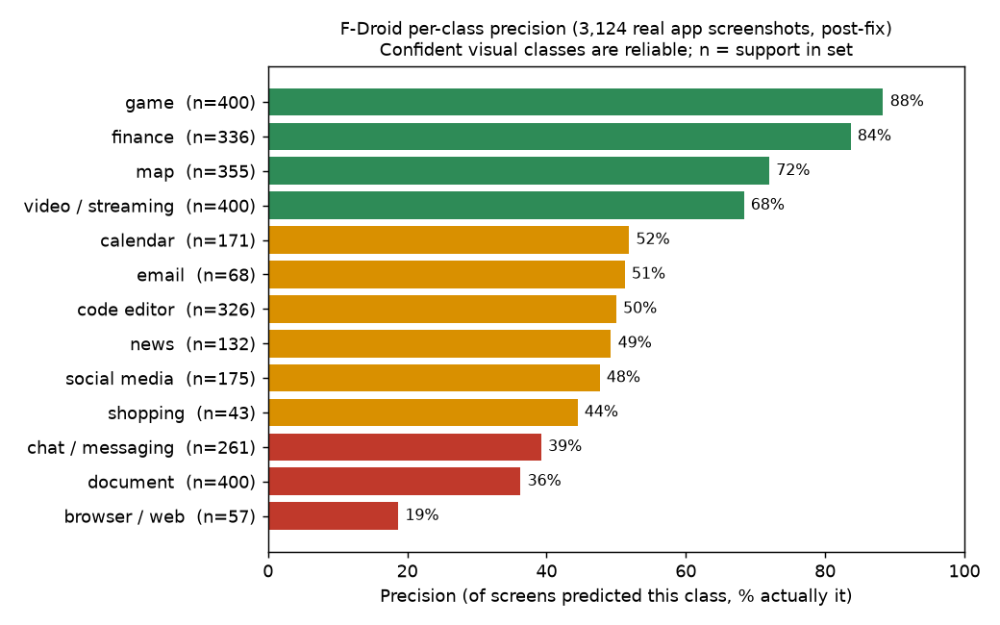
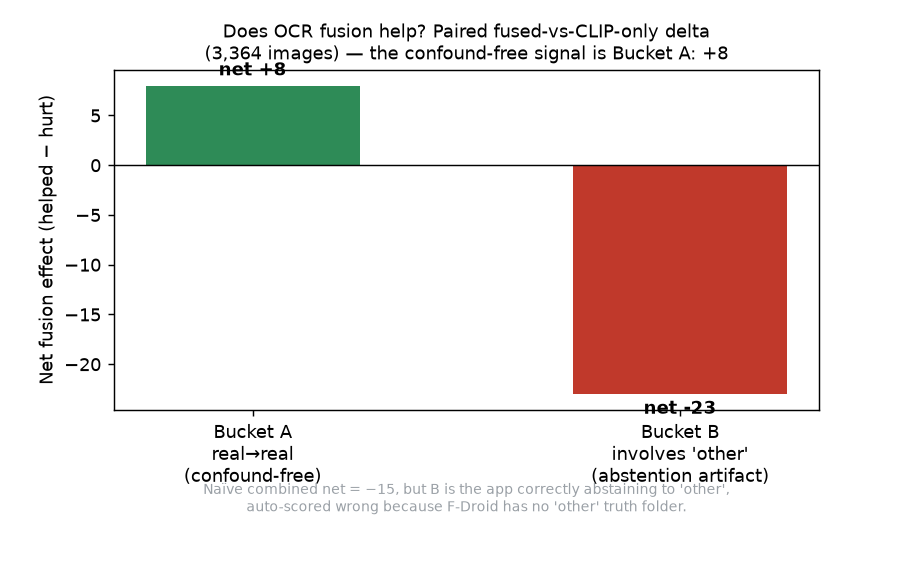
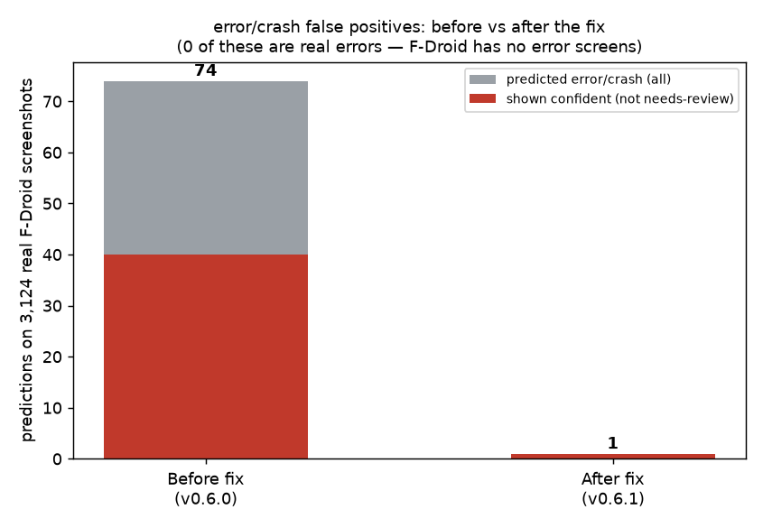
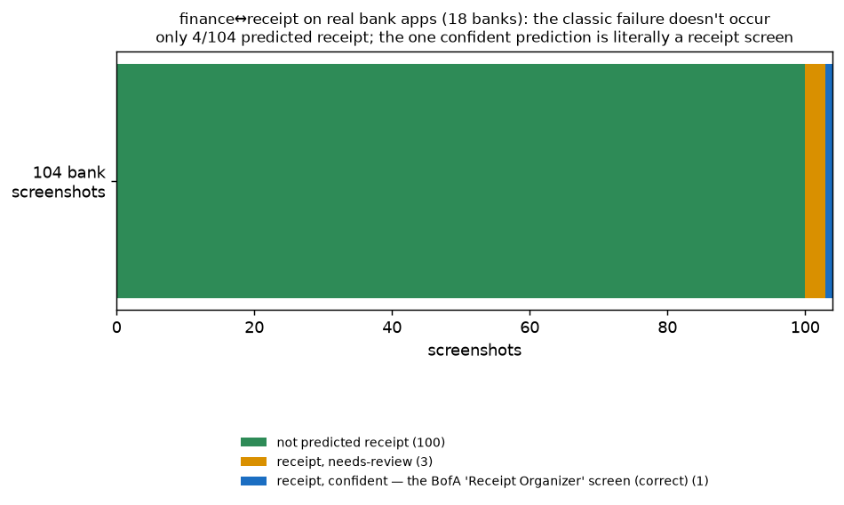
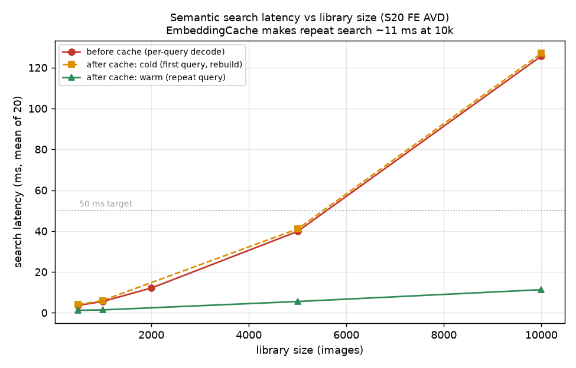

# Performance and accuracy

The single home for how well the app classifies (accuracy) and how fast it runs at scale
(performance). Findings and charts live here; the raw per-image CSVs, manifests, and
instrumented-test specifics live in the companion files this doc links to.

- **Accuracy** measured 2026-06-15 / 2026-06-16 on a Galaxy S20 FE AVD (API 33) with both
  int8 CLIP models installed, over ~3,380 images across four datasets.
- **Performance** measured 2026-06-14 on the same AVD against a real on-disk Room database
  (full raw tables in [docs/spikes/scale-test.md](../spikes/scale-test.md)).

> Read the accuracy numbers honestly. On the broad real-world set, **absolute accuracy is a
> weak-label floor, not a real accuracy** — the trustworthy signals are per-class
> **precision** on confident predictions and the **paired fused-vs-CLIP-only delta**. Where
> the app is unsure it abstains (needs-review) by design rather than mislabel. Every chart
> below is generated directly from the committed CSVs, so the graphs cannot disagree with
> the data.

## Contents

- [Part A — Accuracy](#part-a--accuracy)
  - [How it is measured](#how-it-is-measured)
  - [Datasets](#datasets)
  - [Read precision, not absolute accuracy](#read-precision-not-absolute-accuracy)
  - [Does fusion help? The paired delta](#does-fusion-help-the-paired-delta)
  - [Label noise on the soft classes](#label-noise-on-the-soft-classes)
  - [The email/reddit fix (clean validation)](#the-emailreddit-fix-clean-validation)
  - [Fix: error/crash over-firing](#fix-errorcrash-over-firing)
  - [Investigated, no-fix: finance ↔ receipt](#investigated-no-fix-finance--receipt)
  - [Watch-item: browser/web overprediction](#watch-item-browserweb-overprediction)
  - [Enrico regression slice](#enrico-regression-slice)
- [Part B — Performance](#part-b--performance)
  - [Search latency and memory](#search-latency-and-memory)
  - [Classification throughput](#classification-throughput)
  - [Performance targets vs measured](#performance-targets-vs-measured)
- [Reproduce](#reproduce)
- [Raw data index](#raw-data-index)
- [Bottom line](#bottom-line)

---

# Part A — Accuracy

## How it is measured

`app/src/androidTest/.../pipeline/ClassificationEvalTest.kt` runs the **exact** production
path: ML Kit OCR → `OcrHeuristics` → CLIP image embedding → `ZeroShotClassifier` →
`TagFuser.fuse` → `TagFuser.decide`. The predicted label and the needs-review flag come
from `TagFuser.decide`, the same function `ImageProcessor` uses, so the eval cannot drift
from what ships. It also records the **CLIP-only argmax** (no OCR, no fusion) per image, so
every fusion effect can be isolated as a paired comparison on identical images.

Two hard constraints shaped the method:

1. **OCR is ML Kit, Android only.** The pipeline cannot run as a desktop JVM test; it must
   run on a device/emulator (instrumented test, images in the app's internal files dir). At
   ~0.3 s/image the 3,124-image F-Droid run takes ~16 min on the AVD.
2. **No public dataset matches our taxonomy.** RICO/Enrico has no email, no social/forum,
   no document-of-our-kind class. So Enrico is a regression baseline only; the targeted
   classes need separately-sourced screenshots.

Images are **not committed** (licensing + repo size). Fetch scripts and manifests (source
URL + license + sha256 per image) are committed, so every set is reproducible.

## Datasets

| Set | Source | Images | Label quality | Role |
|---|---|---|---|---|
| F-Droid slice | [F-Droid](https://f-droid.org) catalog `index-v2.json` (FOSS) | 3,124 | **weak** (app-function) | Broad-distribution stress test |
| Enrico slice | [Enrico](https://github.com/luileito/enrico) (MIT) | 240 | approximate (topic map) | Regression on classes that already worked |
| Field slice | Wikimedia Commons FOSS app screenshots | 16 | clean (hand-picked) | The clean email/reddit/document fix test |
| Bank slice | 18 banks' Google Play listings | 104 | targeted (real bank UI) | Probe the finance↔receipt failure |
| Synthetic errors | rendered from documented Android strings | 12 | synthetic | error/crash mechanism check only |

### Why F-Droid, and not a subreddit or GitHub repos of screenshots

Reddit and GitHub app-screenshot dumps are copyrighted and not redistributable, need
API/OAuth, and are not reproducible from a committed manifest. F-Droid apps are openly
licensed, the index is stable and carries a sha256 per asset, and the screenshots are
**real phone captures organized by app function** — so the app's category is a weak label
for free, and the exact set can be rebuilt by anyone from the committed manifest. F-Droid
ships clients for Reddit/Lemmy/Mastodon (the social/forum class) and real Email/Browser/
Navigation apps, which is exactly the coverage the subreddit idea was after, minus the
licensing and reproducibility problems.

F-Droid → our-taxonomy mapping is by primary category (`scripts/eval/fetch_fdroid.py`):
e.g. `Email`→email, `Browser`→browser, `Navigation`/`Public Transport`→map, `Forum`/
`Social Network`→social media, `Messaging`/`AI Chat`→chat, `Finance Manager`/`Wallet`→
finance, game categories→game, etc. To keep the measurement honest: English locale only
(OCR heuristics key on English tokens; a German screen collapses fused→CLIP-only and
dilutes the very delta we measure), deduped by sha256, capped 4/app (F-Droid orders the
hero shot first) and 400/class so game/document don't drown out email/social.

## Read precision, not absolute accuracy

Overall fused accuracy on F-Droid is **1,015/3,124 = 32%**, CLIP-only 33%, predicted
"other" 43%, needs-review 56% (this section and its chart are the post-fix v0.6.1 run, to
match each other; the fusion section below is explicitly the pre-fix run). **That 32% is a
floor, not a real accuracy**, deflated three ways: (1) weak app-function labels, (2) no
"other" truth folder so all 43% "other"/conservative predictions count as wrong, (3) the
app deliberately abstains (56% needs-review) and abstention scores as a miss here.

The honest cut is per-class **precision**: when the app commits to a confident class, is it
right? Visually distinctive classes are reliable; the bottom of the chart is where the real
findings are (note `n` = support, so browser n=57 and email n=68 are noisier estimates).



`error / crash` and `receipt` precision (0% in the raw cut) are *not* model failures — see
the fix and investigation sections below; both are explained by weak labels and the absence
of those truth classes in the set.

## Does fusion help? The paired delta

The trustworthy effect of OCR fusion is the **paired fused-vs-CLIP-only delta on identical
images**, because both sides see the same noisy labels, so label noise largely cancels.

Across all 3,364 dataset images (F-Droid + Enrico), fusion changed the call on 297. Naively
that is helped 46, hurt 61, **net −15** — which looks like "fusion hurts at scale." It does
not. Decomposing by whether "other" is involved removes the confound:



| Bucket | Flips | Helped | Hurt | Net |
|---|---|---|---|---|
| **A — real-class → real-class** (neither side is "other") | 138 | 37 | 29 | **+8** |
| B — involves "other" | 159 | 9 | 32 | −23 |

Bucket B is almost entirely fusion → "other" (152 of 159): the app abstaining on an
ambiguous screen. F-Droid has **no "other" truth folder**, so every such abstention is
auto-scored "hurt" even when abstaining is correct. **The confound-free signal (Bucket A)
is net +8**: fusion helps slightly more than it hurts on real-class flips. "Fusion is
net-negative at scale" would be false.

## Label noise on the soft classes

Pulled the first 12 images from the `email` and `document` F-Droid folders and looked at
them. The `email` folder is ~60–70% **not** inbox UI: it is dominated by F-Droid promo /
feature graphics ("FREE INBOX", "All your accounts in one app", "Secure & Open Source") and
generic messenger shots. The `document` folder is ~40–50% non-document. So the 34% email
recall measures **folder label quality, not the classifier** — F-Droid's `phoneScreenshots`
mixes marketing graphics with real captures. This is exactly why the scale-up cannot
re-validate the email/social fix: those folders are the noisy ones.

## The email/reddit fix (clean validation)

The scaled run complements, not supersedes, the 2026-06-15 field slice. On the 16
hand-picked field images (clean labels), fused 10/16 vs CLIP-only 6/16, and fusion flipped
**4/6 email** images to correct `email`, three of them straight from CLIP's `document` (the
exact reported bug), with 0 regressions. That, plus `OcrHeuristicsTest`, remains the causal
proof of the email/reddit fix. The F-Droid email folder is too noisy to confirm or deny it,
and per Bucket A the broad-distribution fusion effect is mildly positive, so nothing
contradicts the field result.

## Fix: error/crash over-firing

The scale-up's top finding: `error / crash` predicted **80× across F-Droid+Enrico, 0
correct, 42 shown confident**. Cause confirmed by opening the images — the CLIP label
`"an error message dialog"` matched any **modal dialog over a dimmed background** (name
prompts, permission popups), and since error/crash is OCR-authoritative in fusion, that
0.4-weight CLIP vote carried ordinary dialogs to a confident wrong `error / crash`. CLIP
can't tell an error dialog from a normal one visually — they look identical — so this is a
text job, not vision.

The fix (shipped in **v0.6.1**, deliberately surgical, no fusion changes):

1. **Remap the CLIP label** `"an error message dialog"` from `error / crash` → `other`. The
   embedding is keyed on the unchanged internal phrase, so `label_embeddings.f32` stays
   **byte-identical** (22 rows, 45,056 bytes) — softmax denominator unchanged, no model
   regeneration, no broad perturbation. error/crash becomes an OCR-only tag, matching the
   CLIP-for-visual / OCR-for-text split.
2. **Extend the OCR error rule** with documented user-facing Android strings (`keeps
   stopping`, `isn't responding`, `application not responding`, an `unfortunately …
   stopped/crashed` pattern; weak markers needing corroboration). Driven by documented
   system strings, not by any image set.



**Validation (FP side rigorous, recall side not).** F-Droid error/crash false positives
dropped **74 → 1** (the survivor is a terminal screen with real error text). Post-remap
*every* error/crash prediction is pure OCR, so that single hit across 3,124 real screens
also proves the new keywords cost ~0 false positives. No real class regresses (worst
−0.75% on document); Enrico 60% → 61%.

**Real-error recall is NOT validated, and the doc says so.** Clean real mobile error
screenshots are not harvestable from the open web with scriptable tooling (checked ~9
troubleshooting articles / ~35 candidate images, near-zero usable — the "how to fix" web is
stock photos and stylized graphics). A 12-image synthetic set
(`scripts/eval/gen_synth_errors.py`) was a mechanism check only — it confirmed the OCR rule
fires and that dialogs now route to needs-review — **not** a recall number (the strings that
drove the keywords also render the images, so it would be circular). Net effect: ambiguous
error dialogs land on needs-review (honest); only text-rich error screens (stack traces) tag
as `error / crash`.

## Investigated, no-fix: finance ↔ receipt

Headline was `receipt` predicted ~50×, 0 correct, ~33 on finance-labeled screens. Per-image
inspection of all 45 receipt predictions tells a different story. Of the 32 shown confident,
only **7 carry weight ≥ 0.50**, and **6 of those 7 are correct or defensible**: three are
`com.invoiceninja.app` (an invoice app — invoices *are* receipts), two are `happytaxes` (a
tax app; one screen literally titled "RECEIPT"), one is a shopping list (checkout≈receipt,
in the taxonomy by design). The model is right; the F-Droid `finance` app-category label is
wrong. The other 25 confident predictions are low confidence (0.26–0.49) on receipt-
*adjacent* content (expense forms, crypto send/receive with amounts, price lists, an itemized
bus timetable). Exactly **one** is an arguable over-fire (`evmap` price list, 0.56).

**Confirmed on a clean real-bank set.** FOSS finance apps skew to expense/crypto/budget
tools, so they can't show the classic balance-dashboard failure. Pulled **104 real bank-app
screenshots from 18 banks** (Revolut, Monzo, Starling, N26, Chime, Wise, Cash App, Varo;
Chase, BofA, Wells Fargo, Capital One, USAA, HSBC, Barclays) via
`scripts/eval/fetch_bank_dashboards.py`.



Only **4/104 predicted receipt**: 3 low-confidence and correctly flagged needs-review (a
Tap-to-Pay $25 screen, a sales dashboard, a marketing graphic), and the one confident
prediction (BofA, 1.00) is literally a "Receipt Organizer" screen displaying photographed
receipts — i.e. correct. **Zero clean balance dashboards confidently mislabeled receipt.**
The classic failure does not occur; the receipt class is well-behaved on real bank UI.

No safe fix exists: `receipt` is a validated working class (receipt→receipt 1.0 on device)
so it can't be remapped like error/crash; the confusion is CLIP-driven (39/45) so OCR isn't
the lever; and the only CLIP lever (a budgeting/expense decoy label) regenerates all
embeddings, perturbs every image's softmax, and risks the working receipt class for ~1 real
over-fire. **Closed as no-fix with evidence, not deferred.**

## Watch-item: browser/web overprediction

`browser / web` is the lowest-precision class (17%, 98 confident FPs): it acts as a
catch-all for any web-view-shaped screen, partly the desktop/web distribution gap. Risky to
tune (browser is a legitimate class), so it stays a logged watch-item rather than a fix. The
real lever for this and the other CLIP-ceiling weaknesses (social beyond Reddit, dense-text
→ news drift) is the UI-domain-model spike, not a quick tune.

## Enrico regression slice

Fused **144/240 = 60%** (61% after the error/crash fix), CLIP-only 61%, predicted "other"
35%, needs-review 53%. Fusion changed 18 calls, helped 6, hurt 8 (net −2) — the same
Bucket-A/B shape: the helps are all `→ other` on genuine settings screens, the hurts mostly
`document → other/browser/finance` on dense-text screens. Per-class recall: other(settings)
70%, video 66%, chat 64%, news 61%, map 56%, document 31%. Document is the weakest —
terms/long-text walls drift to `news`/`other`, a pre-existing CLIP-ceiling weakness present
in CLIP-only too, not the email fix.

---

# Part B — Performance

Measured 2026-06-14 on the Galaxy S20 FE AVD (1080×2400, API 33) via instrumented tests
against a **real on-disk Room database** (`ScaleInstrumentedTest`,
`ProcessingThroughputTest`). A real device is faster, especially for ML Kit OCR and SQLite,
so treat these as conservative. Full raw tables and test details:
[docs/spikes/scale-test.md](../spikes/scale-test.md).

## Search latency and memory

Semantic search is in-memory brute-force cosine over stored embeddings. The original
implementation re-deserialized every embedding blob from SQLite on **every query**, which
made latency linear and cross the 50 ms target between 5k and 10k images (~126 ms at 10k).
`EmbeddingCache` decodes the vectors once and reuses them (invalidated on embedding change),
so repeat ("warm") queries are ~11 ms at 10k; only the first query after the library changes
pays the one-time rebuild.



| Images | Before cache | Cold (rebuild) | Warm (cached) | Vectors in RAM |
|-------:|-------------:|---------------:|--------------:|---------------:|
| 500    | 3.6 ms       | 4 ms           | 1.2 ms        | 1.0 MB |
| 1,000  | 5.5 ms       | 6 ms           | 1.4 ms        | 2.0 MB |
| 5,000  | 39.8 ms      | 41 ms          | 5.5 ms        | 9.8 MB |
| 10,000 | 125.7 ms     | 127 ms         | 11.3 ms       | 19.5 MB |

At the sizes real users hit (hundreds to low thousands) search is single-digit milliseconds.
Warm search stays under the 50 ms target to 10k and ~22 ms extrapolated at 20k. Memory grows
linearly at ~2 KB/image, matching the design estimate. Move to an HNSW index only if
libraries exceed ~20k — most users never will.

## Classification throughput

300 real screenshots through the real `ImageProcessor` (ML Kit OCR + heuristics, CLIP model
absent — the OCR-only path):

| Metric | Value |
|---|---|
| Processed / failed | 300 / 0 |
| Per image | **21.9 ms** |
| Slowest (first, warmup) | 122 ms |
| Heap before → after (post-GC) | 6 MB → 3 MB (no leak) |
| Projected for 1,000 | ~22 s |

The pipeline drains a deep queue cleanly: steady per-image latency, every item reaches a
terminal state, flat heap (no leak). **Not yet benchmarked:** the CLIP image-encode cost per
screenshot (needs the 90 MB model; design estimates 1–2 s/image and it would dominate a full
re-embed). That is the next performance measurement to take.

## Performance targets vs measured

| Step | Target | Measured (S20 FE AVD) |
|---|---|---|
| CLIP vision encode | 1–2 s / image | not yet benchmarked |
| OCR extract | ~300 ms / image | within OCR-path 21.9 ms/image total |
| Zero-shot classify | ~50 ms / image | within the same path |
| Semantic search (10k) | < 50 ms | **11 ms warm**, 127 ms cold-rebuild |
| Memory for vectors (10k) | ~20 MB | **19.5 MB** |

---

## Reproduce

```bash
# Accuracy datasets
scripts/eval/fetch_enrico.sh .evaldata                       # MIT, full mappable slice (240)
python3 scripts/eval/fetch_field_commons.py .evaldata        # Commons field slice (16)
# F-Droid: download index-v2.json from https://f-droid.org/repo/index-v2.json first
python3 scripts/eval/fetch_fdroid.py .evaldata index-v2.json --per-app 4 --per-class 400
python3 scripts/eval/fetch_bank_dashboards.py .evaldata      # 18 banks' Play listings
python3 scripts/eval/gen_synth_errors.py .evaldata/synth     # synthetic error dialogs

# boot AVD, install app + androidTest apk, install both CLIP int8 models, then run each:
scripts/eval/push_and_run.sh .evaldata/fdroid_slice  fdroid eval-out
scripts/eval/push_and_run.sh .evaldata/enrico_slice  enrico eval-out
scripts/eval/push_and_run.sh .evaldata/field_slice   field  eval-out

# Performance: run the instrumented scale + throughput tests (see scale-test.md)
# Charts: regenerate from the committed CSVs after any re-run.
```

## Raw data index

- **Accuracy raw rows / summaries** (committed): `results-fdroid.csv` (pre-fix),
  `results-fdroid2.csv` (post-fix), `results-enrico.csv`, `results-field.csv`,
  `results-banks.csv`, `results-synth.csv` and their `summary-*.txt`.
- **Manifests** (license + sha256 + URL per image): `fdroid_manifest.json`,
  `enrico_manifest.json`, `field_manifest.json`, `bank_manifest.json`.
- **Charts**: `charts/` (generated from the CSVs above).
- **Performance raw tables + instrumented-test specifics**:
  [docs/spikes/scale-test.md](../spikes/scale-test.md).

## Bottom line

- **Accuracy.** Where the app commits confidently to a visually distinctive class it is
  reliable (game 88%, finance 84%, map 72%, video 68% precision). Absolute accuracy on the
  broad set is a weak-label floor, not a real accuracy; the app abstains (56% needs-review)
  rather than mislabel, by design. OCR fusion is mildly positive on the confound-free signal
  (Bucket A, +8). The email/reddit fix is validated on the clean field slice + unit tests.
  `error / crash` over-firing is fixed (74→1 FPs, v0.6.1); finance↔receipt was investigated
  and closed as not-a-bug on a clean real-bank set; browser/web overprediction is a logged
  watch-item.
- **Performance.** Search and classification are fast and stable at realistic library sizes
  (single-digit ms search, ~22 ms/image OCR classify, no heap leak). The one structural
  finding — brute-force search was linear and only fine to ~5k — is resolved by
  `EmbeddingCache` (warm search ~11 ms at 10k). The open performance measurement is CLIP
  image-encode cost per screenshot.
