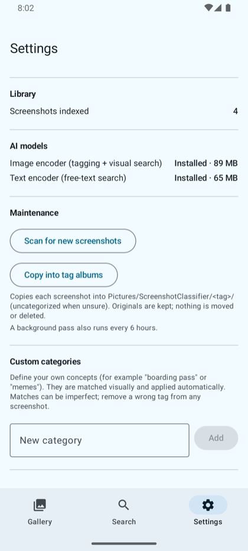
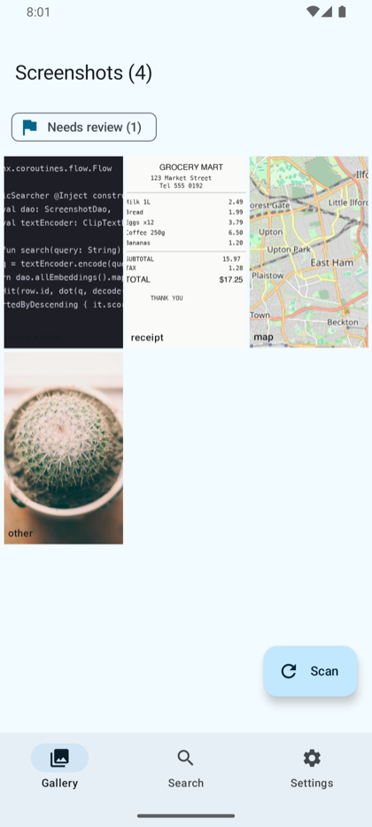
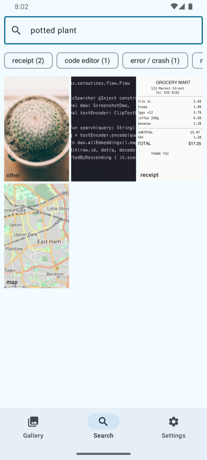
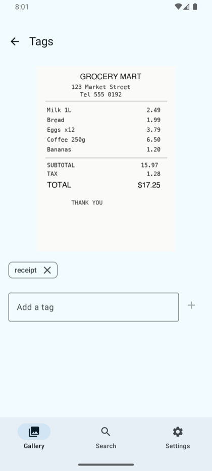
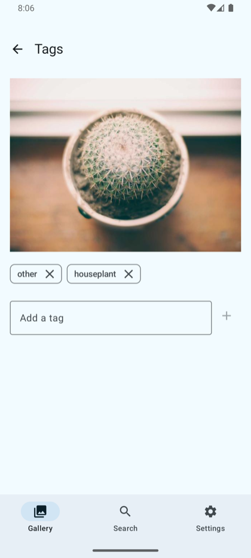
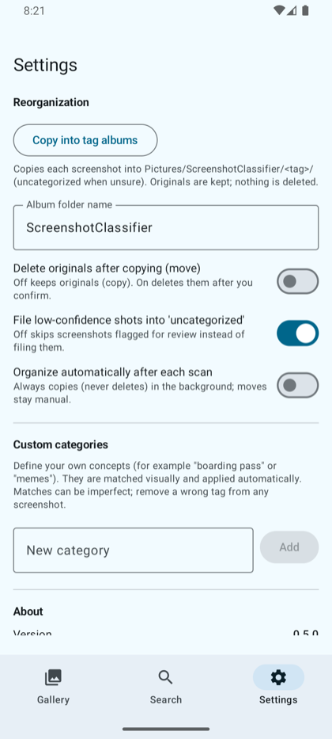

# Usage guide

A walkthrough of every screen, with real captures from a Galaxy S20 FE (Android 13).
The app is fully offline. The only time it touches the network is the one time it
downloads the AI models on first launch.

## Contents

1. [First launch and the AI models](#1-first-launch-and-the-ai-models)
2. [Scanning your screenshots](#2-scanning-your-screenshots)
3. [The gallery and tags](#3-the-gallery-and-tags)
4. [Search: text and visual](#4-search-text-and-visual)
5. [Editing tags by hand](#5-editing-tags-by-hand)
6. [Custom categories](#6-custom-categories)
7. [Needs review](#7-needs-review)
8. [Reorganizing into albums](#8-reorganizing-into-albums)
9. [Capturing real-world things with the camera](#9-capturing-real-world-things-with-the-camera)

---

## 1. First launch and the AI models

On first launch the app downloads two CLIP models from a public mirror: an image
encoder (about 90 MB, used for tagging and visual search) and a text encoder (about
65 MB, used for free text search and custom categories). Each download is verified
with a sha256 checksum, stored in the app's private storage, and never fetched again.

Until the image model is installed the app still works: it tags and searches from the
text it reads inside your screenshots (OCR) only. Once both models are present you get
visual tagging and visual search on top.

You can check model status any time under **Settings > AI models**.

The Settings screen also shows how many screenshots are indexed, a button to scan for
new ones, the reorganize action, and the custom categories editor.

---

## 2. Scanning your screenshots

The app finds screenshots in your device's screenshot folders through MediaStore. It
picks up new ones automatically while it is open, and a background pass also runs every
6 hours so nothing is missed. You can force a pass at any time with **Scan for new
screenshots** in Settings, or the **Scan** button on the gallery.

Under **Settings > Watched folders** you can choose which image folders are watched. New
files in a watched folder are tagged automatically, so you can include more than just the
default Screenshots folder (for example a second folder you save shots into).

Each screenshot goes through the pipeline once: read its text (OCR), then, if the image
model is installed, compute a visual embedding, classify it, and store weighted tags.

---

## 3. The gallery and tags

The gallery is the home screen. Every screenshot shows its top tag in the corner.
Tags are weighted, so an image can carry more than one, and the strongest one is the
label you see on the thumbnail.

In the capture above the receipt, a code screenshot, a street map, and a photo were each
tagged on their own. The chip at the top filters the grid down to the screenshots that
still want a human look (see [Needs review](#7-needs-review)).

Tap any thumbnail to open it.

---

## 4. Search: text and visual

The Search tab does two things at once and blends the results:

- **Text search** matches words the app read inside your screenshots (OCR).
- **Visual search** matches what a screenshot *looks like*, even when none of those
  words appear anywhere in the image.

The two rankings are fused so a screenshot that matches both rises to the top.

The capture shows a search for "potted plant". None of the screenshots contain that
text, yet the cactus photo ranks first because the app recognizes it visually. You can
also tap a tag chip to filter by a tag instead of typing. Tap any result to open it enlarged
with its details (same view as the gallery).

---

## 5. Editing tags by hand

Open any screenshot (from the gallery or a search result) to see it enlarged with its tags.
You can remove any tag, including a wrong automatic one, by tapping its X, and add your own
with the **Add a tag** field. The screen also shows the **extracted text (OCR)** the app read
from the image; select it, or tap the copy button to put it on the clipboard.

**Tap the image** to open it full screen: pinch or double-tap to zoom, drag to pan, rotate
the view, **share** the file or **open it in another app**, and view its info (name, date,
dimensions, size). Rotating and zooming only change what you see, never the saved file.

Tags you add or remove are treated as the final word: editing a screenshot marks it as
reviewed and clears it from the Needs review list. Your tags show up as filter chips in
Search just like the automatic ones.

---

## 6. Custom categories

Beyond the built in tags you can define your own visual concepts. Type a concept in
**Settings > Custom categories** (for example "boarding pass" or "houseplant"). The text
encoder turns it into a visual concept on device, then scores it against every screenshot
you already have and tags the ones that match. New screenshots are scored automatically
from then on.

Here a "houseplant" category was added and it picked up the cactus photo, sitting next to
its built in "other" tag. Custom categories are additive: they never change the built in
tags, so they cannot make the automatic tagging worse. They are also imperfect, so if a
category tags something it should not, just remove that tag in the screenshot's editor.

Custom categories need the text model, so the section is disabled until it is installed.

---

## 7. Needs review

When the app is not confident about a screenshot's tags (nothing stuck, the top guess was
borderline, or it only landed on the catch all "other") it flags the screenshot for review
instead of pretending it got it right. The gallery shows a **Needs review (N)** chip;
tap it to see just those screenshots and fix them up. Editing the tags clears the flag.

---

## 8. Reorganizing into albums

From **Settings**, the reorganization action files each screenshot into
`Pictures/<album root>/<tag>/`, putting anything still in Needs review into an
`uncategorized` album. Running it again only handles what is new.

It is configurable:

- **Copy or move.** By default it copies, so your originals are kept exactly where they
  are and nothing is deleted. Turn on **Delete originals after copying (move)** to move
  instead. A move first copies into the album, then asks you to approve deleting the
  originals in a system dialog, so a deletion never happens without your explicit yes.
  After a move an **Undo last move** button restores the originals from their copies.
  Move needs Android 11 or newer; older devices can only copy.
- **Album folder name.** Rename the root folder from the default "ScreenshotClassifier".
- **Needs review handling.** Choose whether low-confidence screenshots go to
  "uncategorized" or are skipped entirely.
- **Organize automatically after each scan.** When on, new screenshots are copied into
  albums in the background after each scan. This always copies and never deletes, even
  if move is selected, because a background pass cannot ask you to confirm a deletion.

Because the database keeps tracking files (and repoints itself when you move one), search
and tags keep working regardless of how the albums are laid out.

---

## 9. Capturing real-world things with the camera

The app is not only for screenshots. The camera button on the gallery (the round icon
above **Scan**) opens an in-app camera so you can photograph real-world things and file
them into the same inventory: storefronts, street signs, advertisements, business cards,
products, menus, posters, and QR codes.

Tap the shutter to capture. The photo is saved to your gallery under
`Pictures/ScreenshotClassifier/Captures` (so you keep the original), then it goes through
the same pipeline as a screenshot: it reads any text (OCR), classifies what it looks like,
and writes tags. The camera stays open so you can capture several things in a row; a small
"Captured N" appears as confirmation.

**QR codes are decoded on device.** If a capture contains a QR code or barcode, the app
reads the code, tags the photo `qr code`, and stores the decoded value (for a link, the
URL). This decoding is fully offline: the app reads the code but does not open or fetch the
link. You can see the decoded value, and a short description of the capture, by tapping the
photo to open it.

Once you have captures, the gallery shows an **All / Screenshots / Photos** filter so you
can browse your screenshots and your real-world photos separately.

**Finding near-duplicates.** Once the image model is installed, a **Find near-duplicates**
chip on the gallery groups visually near-identical images (the same screen captured twice, a
photo burst, a recompressed copy). Tapping it filters the grid to just those, with group
members next to each other, so you can open and clean them up. Exact duplicates never get
indexed twice in the first place, so this is about visually similar shots, not byte-identical
ones. Nothing is deleted automatically.

**Previewing where a QR link goes.** You can optionally let the app resolve a scanned link
into a preview (its title, description, and image). This is the one part of the capture
feature that uses the network, so it is **off by default**. Turn it on under **Settings >
Camera capture > Resolve QR links**. With it on, the default is still manual: open a capture
and tap **Resolve link**. You can switch it to resolve automatically during processing, and
you can restrict it to Wi-Fi only and choose whether the preview image is downloaded (off by
default, since loading it contacts the image host). Nothing is fetched unless you enable this
and, by default, tap to resolve.

> Note on an earlier statement: a previous version of this guide said link resolution would
> be "never an automatic fetch." That was too absolute. Resolution is off by default and
> manual by default, but it is now a setting you can switch to automatic if you want it. The
> default behavior still never touches the network on its own.

**Description source (experimental generative captions).** Every capture gets a short
description, by default composed offline from its text, tags, and any QR link (the
**Structured** source). On a high-end phone (roughly Pixel 8 / Galaxy S23 or newer) you can
opt into an experimental **Generative** source under **Settings > Camera capture**: an
on-device vision-language model writes a free-form caption instead. It is off and disabled by
default, and only selectable after you import a model file, because the model is large (~3 GB)
and is never bundled with the app. Tap **Import model**, pick a Gemma 3n `.task` file you
downloaded yourself (accepting its licence at the source), and once it copies you can switch
the source to Generative. It is slow (tens of seconds per photo on CPU) and falls back to the
structured description on any error. On phones that do not qualify, the option is disabled with the
reason shown — but you can force it on for testing via **Settings > Developer > Developer mode**,
which also lets you export debug logs to report how a device behaved. Forcing it on an under-spec
device may be slow or crash (it still falls back to a structured description). This path has not been
verified by us on real hardware yet, so treat it as experimental.
